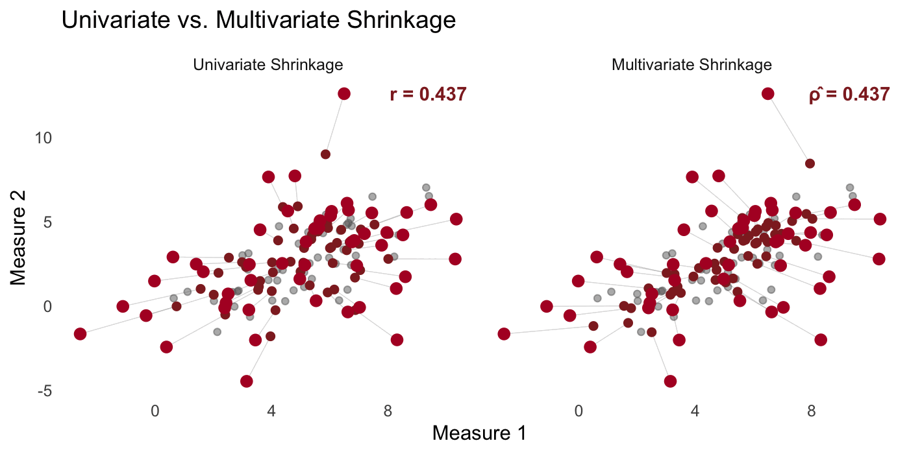

```{r setup}
library(MASS)
library(dplyr)
library(tidyr)
library(foreach)
library(ggplot2)
library(glmnet)
library(lme4)
library(brms)

# Color palette
col_dusty    <- "#DCBCBC"
col_darkred  <- "#8F2727"
col_red      <- "#B2182B"
col_green    <- "#4daf4a"
col_ltgreen  <- "#78c679"
col_blue     <- "#2166AC"
col_ltblue   <- "#8ec2de"

# Slide theme
theme_slide <- theme_minimal(base_size = 20) +
  theme(panel.grid = element_blank(),
        plot.title = element_text(size = 24, face = "bold"))
```

# {.center}

<br>

Every time we compute a mean per participant, we use an **inadmissible** estimator

. . .

This has consequences far beyond estimation — it corrupts correlations, reliability, rankings, and effect sizes

. . .

250 years of independent discoveries all point to the same fix

::: {.notes}
Don't open gently — lead with the provocation. The sample mean is inadmissible for estimating 3+ means simultaneously (Stein, 1956). But the real damage isn't just in point estimation. When we enter noisy sample means into secondary analyses — correlations, regressions, group comparisons — we propagate that error downstream. This talk will cover the theory, show how multiple fields independently discovered the fix, and then show what happens when we take measurement error seriously in real psychological research.
:::

## Stein's Result (1956) {.center}

The sample mean $\hat{\mu}_i = \bar{y}_i$ is the **MVUE** for a single mean

. . .

For **3 or more** means simultaneously, it is **inadmissible**

. . .

There exists an estimator with strictly lower total MSE for *every possible* $\boldsymbol{\mu}$

. . .

So counterintuitive it became known as **Stein's Paradox**

::: {.notes}
MVUE = minimum variance unbiased estimator. For one mean, the sample mean is the best you can do. But Stein proved that for 3+ simultaneous means, there always exists a better estimator — strictly lower MSE for EVERY configuration of true values. James & Stein (1961) gave the constructive proof. The fix: shrink toward a common target.
:::

## One Insight, Many Discoverers

```{r}
#| fig-width: 14
#| fig-height: 5
timeline_df <- data.frame(
  year  = c(1763, 1927, 1956, 1956, 1961, 1970, 1990),
  label = c("Bayes", "Kelley /\nCTT", "Stein\n(Proof)", "Robbins /\nEmpirical Bayes", "James-Stein\n(Estimator)", "Ridge\nRegression", "Hierarchical\nModels"),
  y     = c(0.5, -0.5, 0.5, -0.5, 0.5, -0.5, 0.5)
)

ggplot(timeline_df, aes(x = year, y = 0)) +
  geom_hline(yintercept = 0, color = "gray50", linewidth = 1) +
  geom_segment(aes(xend = year, yend = y), color = col_dusty, linewidth = 0.8) +
  geom_point(size = 5, color = col_darkred) +
  geom_label(aes(y = y, label = label), size = 5, fill = "gray20",
             color = "white", label.padding = unit(0.4, "lines"),
             fontface = "bold") +
  scale_x_continuous(breaks = timeline_df$year) +
  ylim(-1, 1) +
  labs(x = NULL, y = NULL,
       title = "Independent Discoveries of the Same Principle") +
  theme_slide +
  theme(axis.text.y = element_blank(),
        axis.text.x = element_text(size = 14),
        panel.grid = element_blank())
```

::: {.notes}
Discovered independently across centuries. Bayes (1763), Kelley/CTT (1920s), Stein (1956), Robbins/EB (1956), James-Stein (1961), Ridge (1970s), hierarchical models (1990s). These traditions actively resisted each other. Frequentists rejected Bayes. Psychometricians published in education journals statisticians didn't read. ML people reinvented penalized estimation from scratch. Convergence happened despite, not because of, cross-disciplinary communication.
:::

# Part I: The Univariate Case

## Simulation Setup {.center}

$$\mu_i \sim \mathcal{N}(\mu_{\text{pop}},\; \sigma_{\text{pop}}), \quad y_{i,t} \sim \mathcal{N}(\mu_i,\; \sigma_{\text{obs}})$$

<br>

| | |
|---|---|
| $N = 30$ individuals, $n = 10$ observations each | |
| $\sigma_{\text{pop}} = 2$ (between-person), $\sigma_{\text{obs}} = 6$ (within-person) | |
| **Reliability** $\approx \frac{\sigma^2_{\text{pop}}}{\sigma^2_{\text{pop}} + \sigma^2_{\text{obs}}/n} = \frac{4}{4 + 3.6}$ | **≈ 0.53** |

::: {.notes}
30 individuals, 10 noisy observations each. The key number: reliability ≈ 0.53. Only about half the variance in sample means reflects true differences — the rest is noise. This is actually optimistic for many behavioral paradigms.
:::

## The Sample Mean: Unbiased but Noisy

```{r}
set.seed(43202)

N_subj    <- 30
n_obs     <- 10
mu_pop    <- 5
sigma_pop <- 2
sigma_obs <- 6

mu_true <- rnorm(N_subj, mu_pop, sigma_pop)

obs_data <- foreach(i = 1:N_subj, .combine = "rbind") %do% {
  data.frame(subj = i, mu_true = mu_true[i], y = rnorm(n_obs, mu_true[i], sigma_obs))
}

subj_summary <- obs_data %>%
  group_by(subj) %>%
  summarize(mu_true = unique(mu_true), x_bar = mean(y),
            var_y = var(y), se_sample = sd(y) / sqrt(n()), .groups = "drop")

rmse_sample_mean <- sqrt(mean((subj_summary$x_bar - subj_summary$mu_true)^2))

subj_summary %>%
  ggplot(aes(x = mu_true, y = x_bar)) +
  geom_abline(slope = 1, intercept = 0, linetype = 2, color = "gray50") +
  geom_linerange(aes(ymin = x_bar - 1.96 * se_sample,
                     ymax = x_bar + 1.96 * se_sample),
                 color = col_dusty, alpha = 0.5) +
  geom_point(color = col_dusty, size = 4) +
  labs(x = expression("True" ~ mu[i]),
       y = expression("Estimated" ~ hat(mu)[i]),
       title = paste0("Sample Mean  (RMSE = ", round(rmse_sample_mean, 2), ")")) +
  theme_slide
```

::: {.notes}
True mean on x-axis, sample mean on y-axis. Dashed line = perfect estimation. Substantial scatter. The sample mean is unbiased — correct on average across infinite experiments — but for the one dataset we have, it's often far off. Can we trade a little bias for a lot of variance reduction?
:::

## All Shrinkage Methods Converge {.center}

Every method takes the same form:

$$\hat{\mu}_i = \hat{\mu}_{\text{pop}} + \hat{B} \cdot (\bar{y}_i - \hat{\mu}_{\text{pop}})$$

where $\hat{B} = \dfrac{\sigma^2_{\text{pop}}}{\sigma^2_{\text{pop}} + \sigma^2_{\text{obs}}/n_i} \quad = \quad \dfrac{\text{Signal}}{\text{Signal} + \text{Noise}}$

<br>

| Method | Shrinkage Factor |
|--------|-----------------|
| James-Stein (1961) | $1 - \frac{(N-3)\hat{\sigma}^2_{\text{obs}}/n}{\sum(\bar{y}_i - \bar{\bar{y}})^2}$ |
| CTT / Kelley (1920s) | Reliability $\hat{\rho}$ |
| Empirical Bayes | $\frac{\hat{\sigma}^2_{\text{pop}}}{\hat{\sigma}^2_{\text{pop}} + \hat{\sigma}^2_{\text{obs}}/n_i}$ |
| Ridge Regression | $\frac{n_i}{n_i + \lambda}$ where $\lambda = \sigma^2_{\text{obs}}/\sigma^2_{\text{pop}}$ |
| Hierarchical Models (lme4, brms) | $\frac{\hat{\sigma}^2_{\text{pop}}}{\hat{\sigma}^2_{\text{pop}} + \hat{\sigma}^2_{\text{obs}}/n_i}$ |

::: {.notes}
Rather than show each method's scatter plot — they all look the same — here's the punchline. Six methods from six traditions, all reducing to signal over signal-plus-noise. Start at the group mean, move toward the individual's sample mean, but only by a fraction reflecting how much signal there is relative to noise.

If you use lmer or brms, you already do this — the BLUPs from a random-intercept model implement exactly this shrinkage. You just might not realize it.
:::

## Six Methods, Same Answer

```{r}
# Compute all estimators
grand_mean  <- mean(subj_summary$x_bar)
sigma2_pool <- mean(subj_summary$var_y)
se2_mean    <- sigma2_pool / n_obs
SS          <- sum((subj_summary$x_bar - grand_mean)^2)
B_js        <- min(((N_subj - 3) * se2_mean) / SS, 1)

var_x_bar      <- var(subj_summary$x_bar)
rho_hat        <- 1 - (se2_mean / var_x_bar)
mu_pop_hat     <- grand_mean
sigma2_pop_hat <- max(var_x_bar - se2_mean, 0.001)

subj_summary <- subj_summary %>%
  mutate(
    js_est  = grand_mean + (1 - B_js) * (x_bar - grand_mean),
    se_js   = (1 - B_js) * se_sample,
    ctt_est = grand_mean + rho_hat * (x_bar - grand_mean),
    se_ctt  = sd(x_bar) * sqrt(1 - rho_hat) * sqrt(rho_hat),
    B_eb    = sigma2_pop_hat / (sigma2_pop_hat + sigma2_pool / n_obs),
    eb_est  = mu_pop_hat + B_eb * (x_bar - mu_pop_hat),
    se_eb   = sqrt(1 / (n_obs / sigma2_pool + 1 / sigma2_pop_hat))
  )

rmse_js  <- sqrt(mean((subj_summary$js_est - subj_summary$mu_true)^2))
rmse_ctt <- sqrt(mean((subj_summary$ctt_est - subj_summary$mu_true)^2))
rmse_eb  <- sqrt(mean((subj_summary$eb_est - subj_summary$mu_true)^2))

X_mat <- model.matrix(~ 0 + factor(subj), data = obs_data)
fit_ridge <- cv.glmnet(X_mat, obs_data$y, alpha = 0, intercept = TRUE,
                       standardize = FALSE)
ridge_coefs <- coef(fit_ridge, s = "lambda.min")
subj_summary <- subj_summary %>%
  mutate(ridge_est = as.numeric(ridge_coefs[1]) + as.numeric(ridge_coefs[-1]))
rmse_ridge <- sqrt(mean((subj_summary$ridge_est - subj_summary$mu_true)^2))
```

```{r}
#| cache: true
#| results: hide
fit_lmer <- lmer(y ~ 1 + (1 | subj), data = obs_data)
blups    <- coef(fit_lmer)$subj[, "(Intercept)"]
re_vars  <- as.numeric(attr(ranef(fit_lmer, condVar = TRUE)$subj, "postVar"))

fit_brms <- brm(
  y ~ 1 + (1 | subj), data = obs_data, family = gaussian(),
  prior = c(
    prior(normal(0, 10), class = "Intercept"),
    prior(normal(0, 5),  class = "sd"),
    prior(normal(0, 10), class = "sigma")
  ),
  chains = 4, iter = 2000, warmup = 1000, seed = 43202,
  silent = 2, refresh = 0
)

ranefs   <- ranef(fit_brms)$subj[, , "Intercept"]
fixef_mu <- fixef(fit_brms)["Intercept", "Estimate"]

subj_summary <- subj_summary %>%
  mutate(hier_freq_est  = blups,
         se_hier_freq   = sqrt(re_vars),
         hier_bayes_est = fixef_mu + ranefs[, "Estimate"],
         se_hier_bayes  = ranefs[, "Est.Error"])

rmse_hier_freq  <- sqrt(mean((subj_summary$hier_freq_est - subj_summary$mu_true)^2))
rmse_hier_bayes <- sqrt(mean((subj_summary$hier_bayes_est - subj_summary$mu_true)^2))
```

```{r}
#| fig-height: 5.5
all_methods <- bind_rows(
  subj_summary %>% transmute(subj, mu_true, x_bar,
    estimate = js_est, method = paste0("James-Stein (", round(rmse_js, 2), ")")),
  subj_summary %>% transmute(subj, mu_true, x_bar,
    estimate = ctt_est, method = paste0("CTT (", round(rmse_ctt, 2), ")")),
  subj_summary %>% transmute(subj, mu_true, x_bar,
    estimate = eb_est, method = paste0("Emp. Bayes (", round(rmse_eb, 2), ")")),
  subj_summary %>% transmute(subj, mu_true, x_bar,
    estimate = ridge_est, method = paste0("Ridge (", round(rmse_ridge, 2), ")")),
  subj_summary %>% transmute(subj, mu_true, x_bar,
    estimate = hier_freq_est, method = paste0("lme4 (", round(rmse_hier_freq, 2), ")")),
  subj_summary %>% transmute(subj, mu_true, x_bar,
    estimate = hier_bayes_est, method = paste0("brms (", round(rmse_hier_bayes, 2), ")"))
)

all_methods %>%
  ggplot(aes(x = mu_true, y = estimate)) +
  geom_abline(slope = 1, intercept = 0, linetype = 2, color = "gray50") +
  geom_segment(aes(xend = mu_true, yend = x_bar), color = col_dusty, alpha = 0.4) +
  geom_point(aes(y = x_bar), color = col_dusty, size = 2, alpha = 0.4) +
  geom_point(color = col_darkred, size = 2.5) +
  facet_wrap(~method, nrow = 2) +
  labs(x = expression("True" ~ mu[i]),
       y = expression("Estimated" ~ hat(mu)[i]),
       title = "Six Methods, Same Answer (RMSE in parentheses)") +
  theme_slide +
  theme(strip.text = element_text(size = 14))
```

::: {.notes}
All six methods in a single panel. Dusty rose = sample means, dark red = shrunken estimates. Every method pulls extremes inward toward the identity line. RMSEs in parentheses — all substantially better than the sample mean and nearly identical to each other. The convergence is real.
:::

## Shrinkage Is Data-Adaptive

```{r}
#| cache: true
#| results: hide
set.seed(43202)

n_obs_vec <- c(5, 10, 25, 50, 100)

rmse_by_nobs <- foreach(n = seq_along(n_obs_vec), .combine = "rbind") %do% {
  n_obs_k <- n_obs_vec[n]
  obs_k <- foreach(i = 1:N_subj, .combine = "rbind") %do% {
    data.frame(subj = i, mu_true = mu_true[i],
               y = rnorm(n_obs_k, mu_true[i], sigma_obs))
  }

  summ_k <- obs_k %>%
    group_by(subj) %>%
    summarize(mu_true = unique(mu_true),
              x_bar = mean(y), var_y = var(y), .groups = "drop")

  gm_k  <- mean(summ_k$x_bar)
  s2p_k <- mean(summ_k$var_y)
  se2_k <- s2p_k / n_obs_k
  SS_k  <- sum((summ_k$x_bar - gm_k)^2)
  B_js_k <- min(((N_subj - 3) * se2_k) / SS_k, 1)
  js_k   <- gm_k + (1 - B_js_k) * (summ_k$x_bar - gm_k)

  fit_k  <- lmer(y ~ 1 + (1 | subj), data = obs_k)
  hier_k <- coef(fit_k)$subj[, "(Intercept)"]

  data.frame(
    n_obs  = n_obs_k,
    Method = c("Sample Mean", "James-Stein", "Hierarchical (lme4)"),
    RMSE   = c(sqrt(mean((summ_k$x_bar - summ_k$mu_true)^2)),
               sqrt(mean((js_k - summ_k$mu_true)^2)),
               sqrt(mean((hier_k - summ_k$mu_true)^2)))
  )
}
```

```{r}
rmse_by_nobs %>%
  mutate(Method = factor(Method,
    levels = c("Sample Mean", "James-Stein", "Hierarchical (lme4)"))) %>%
  ggplot(aes(x = n_obs, y = RMSE, color = Method)) +
  geom_line(linewidth = 1.2) +
  geom_point(size = 3.5) +
  scale_color_manual(values = c(
    "Sample Mean"          = col_dusty,
    "James-Stein"          = col_darkred,
    "Hierarchical (lme4)"  = col_blue
  )) +
  labs(x = "Observations per Individual (n)", y = "RMSE",
       title = "Shrinkage Helps Most When Data Are Sparse") +
  theme_slide +
  theme(legend.position = "right")
```

::: {.notes}
"But what if shrinkage is too much?" — it's data-adaptive. When n is small, the advantage is large. As n grows, sigma_obs/n → 0, signal-to-noise → 1, all methods converge to the sample mean. Shrinkage can never hurt — at worst it does nothing. In typical behavioral research with 10-50 trials, gains are substantial.

OK — so the univariate case is clear. But this is really just the warmup. The interesting part is what happens when we use these noisy estimates in secondary analyses.
:::

# Part II: The Bivariate Case — Where It Really Matters

## The Two-Stage Problem {.center}

<br>

Most individual differences research follows a **two-stage pipeline**:

<br>

1. Compute summary statistics per participant (means, difference scores, slopes)
2. Enter those estimates into a secondary model (correlation, regression, group comparison)

. . .

<br>

### Stage 1 treats estimates as if they were the true latent quantities

. . .

Everything downstream is corrupted

::: {.notes}
This is where the talk becomes directly relevant to your research. Almost everyone in this room does some version of the two-stage approach. Compute a Stroop effect per participant, a learning rate, an accuracy score — then correlate it with something else, or compare groups, or predict an outcome. The problem: stage 1 ignores measurement error. You're treating noisy estimates as if they were true scores. Everything downstream is biased.
:::

## Attenuation of Correlations {.center}

<br>

$$r_{\text{obs}} = \rho_{\text{true}} \cdot \sqrt{\rho_{xx,1} \cdot \rho_{xx,2}}$$

<br>

**Why?** The covariance (numerator) is **unbiased** — measurement errors are independent, so cross-terms vanish

But the standard deviations (denominator) are **inflated** by $\sigma^2_{\text{obs}}/n$

. . .

<br>

| $\rho_{xx,1}$ | $\rho_{xx,2}$ | True $\rho$ | Observed $r$ |
|:---------:|:---------:|:--------:|:------------:|
| 0.5 | 0.5 | 0.5 | **0.25** |
| 0.3 | 0.3 | 0.5 | **0.15** |
| 0.5 | 0.8 | 0.5 | **0.32** |

. . .

**A real effect of $\rho = 0.5$ can look like $r = 0.15$ — "not significant"**

::: {.notes}
This is the classical attenuation formula (Spearman, 1904). The key asymmetry: measurement error doesn't affect the covariance between two measures — the noise on measure 1 is independent of everything about measure 2, so it drops out of the numerator. But the denominator — the product of standard deviations — includes measurement error variance on top of the true between-person variance. So the denominator is too big, and the correlation is systematically biased toward zero.

With reliabilities of 0.3 — common for behavioral task measures — a true r of 0.5 appears as 0.15. Not significant in typical samples. You conclude no effect when the effect is real.
:::

## Simulation Setup {.center}

$$(\theta_{1,i}, \theta_{2,i}) \sim \text{MVN}\left(\boldsymbol{\mu}, \boldsymbol{\Sigma}_{\text{pop}}\right), \quad y_{k,i,t} \sim \mathcal{N}(\theta_{k,i}, \sigma_{\text{obs}})$$

<br>

| | |
|---|---|
| $N = 50$ individuals, $n = 10$ trials per measure | |
| $\sigma_{\text{pop}} = 2$ (between-person), $\sigma_{\text{obs}} = 6$ (within-person) | |
| $\rho_{\text{true}} = 0.7$ | |
| **Reliability** $\approx 4 / (4 + 3.6)$ | **≈ 0.53** |
| **Expected** $r_{\text{obs}} \approx 0.7 \times \sqrt{0.53^2}$ | **≈ 0.37** |

::: {.notes}
Same reliability as Part 1 (0.53), but now two correlated measures. True correlation is 0.7 — a large effect. But with reliability of 0.53 on each measure, the attenuation formula predicts we'll observe r ≈ 0.37. A large effect cut nearly in half. Let's see it.
:::

## The Naive Approach: Attenuated Correlation

```{r}
#| fig-width: 12
#| fig-height: 5.5
set.seed(43202)

N_bv      <- 50
n_bv      <- 10
mu1       <- 5; mu2 <- 3
sigma_pop <- 2
sigma_obs <- 6
rho_true  <- 0.7

Sigma_pop <- matrix(c(sigma_pop^2, rho_true * sigma_pop^2,
                       rho_true * sigma_pop^2, sigma_pop^2), 2, 2)
theta_bv  <- mvrnorm(N_bv, mu = c(mu1, mu2), Sigma = Sigma_pop)

y1_bv <- matrix(rnorm(N_bv * n_bv, theta_bv[, 1], sigma_obs), N_bv, n_bv)
y2_bv <- matrix(rnorm(N_bv * n_bv, theta_bv[, 2], sigma_obs), N_bv, n_bv)
ybar1 <- rowMeans(y1_bv); ybar2 <- rowMeans(y2_bv)

r_naive_bv <- cor(ybar1, ybar2)
r_true_bv  <- cor(theta_bv[, 1], theta_bv[, 2])

bv_scatter <- bind_rows(
  data.frame(x = theta_bv[, 1], y = theta_bv[, 2],
             panel = paste0("True Scores (\u03C1 = ", round(r_true_bv, 2), ")")),
  data.frame(x = ybar1, y = ybar2,
             panel = paste0("Sample Means (r = ", round(r_naive_bv, 2), ")"))
) %>%
  mutate(panel = factor(panel, levels = unique(panel)))

ggplot(bv_scatter, aes(x = x, y = y)) +
  geom_point(size = 3, alpha = 0.6, color = col_darkred) +
  geom_smooth(method = "lm", se = FALSE, color = col_dusty, linewidth = 1) +
  facet_wrap(~panel) +
  labs(x = "Measure 1", y = "Measure 2",
       title = paste0("True \u03C1 = ", rho_true, " but observed r = ", round(r_naive_bv, 2))) +
  theme_slide +
  theme(strip.text = element_text(size = 16))
```

::: {.notes}
Left: the true latent scores — the relationship is clear. Right: the sample means computed from 10 noisy trials each. The cloud has expanded, the correlation is attenuated. We went from a true correlation of 0.7 to an observed r around 0.37. This is the default in most of psychology: compute summary scores, then correlate.
:::

## Univariate Shrinkage Doesn't Help {.center}

<br>

Part 1 taught us to shrink means. Natural idea: shrink each measure, then correlate.

. . .

<br>

$$\hat{\theta}_{1,i} = \hat{\mu}_1 + B_1(\bar{y}_{1,i} - \hat{\mu}_1), \quad \hat{\theta}_{2,i} = \hat{\mu}_2 + B_2(\bar{y}_{2,i} - \hat{\mu}_2)$$

. . .

<br>

But the Pearson $r$ is **scale-invariant**: $r(\hat{\theta}_1, \hat{\theta}_2) = r(\bar{y}_1, \bar{y}_2)$

. . .

Univariate shrinkage just rescales each axis — it **cannot change the correlation**

. . .

<br>

### To fix correlations, we need **multivariate** thinking

::: {.notes}
This is the key insight that motivates the rest of the talk. Univariate shrinkage — everything we did in Part 1 — makes each individual's estimates better, but it does nothing for correlation estimation. The Pearson correlation is scale-invariant: multiplying each variable by a constant (which is what univariate shrinkage does — it's a linear rescaling toward the mean) doesn't change the correlation. You can verify this easily: shrink both measures using Kelley, James-Stein, or empirical Bayes, recompute the correlation — identical to the naive estimate.

This is why the bivariate case is fundamentally harder than the univariate case. We need methods that model the joint distribution.
:::

## From Scalars to Matrices {.center}

<br>

::: {.columns}

::: {.column width="45%"}

**Part 1 (Means)**

$$\hat{\mu}_i = \hat{\mu}_{\text{pop}} + B(\bar{y}_i - \hat{\mu}_{\text{pop}})$$

where $B = \dfrac{\sigma^2_{\text{pop}}}{\sigma^2_{\text{pop}} + \sigma^2_{\text{obs}}/n}$

:::

::: {.column width="55%"}

**Part 2 (Correlations)**

$$\hat{\boldsymbol{\theta}}_i = \hat{\boldsymbol{\mu}} + \mathbf{B}(\bar{\mathbf{y}}_i - \hat{\boldsymbol{\mu}})$$

where $\mathbf{B} = \boldsymbol{\Sigma}_{\text{pop}}\left(\boldsymbol{\Sigma}_{\text{pop}} + \boldsymbol{\Sigma}_{\text{obs}}/n\right)^{-1}$

:::

:::

. . .

<br>

The off-diagonal elements of $\mathbf{B}$ are **non-zero** when the measures are correlated

Each estimate borrows strength from **both** measures — this is what changes the correlation

::: {.notes}
The fix is elegant: replace scalars with matrices. Same formula, same principle — signal over signal-plus-noise — but now B is a 2×2 matrix. The diagonal elements are the univariate shrinkage factors from Part 1. The off-diagonal elements are new: they capture how much one measure's data helps predict the other measure's true score. When the measures are truly correlated, the off-diagonals are non-zero, and the shrinkage borrows strength across measures. This is what changes the correlation.

B₁₂ captures: how much of ȳ₂'s variation is useful for predicting θ₁? If ρ_true ≠ 0, the answer is: some of it. An individual who scores high on measure 2 gets pulled upward on measure 1, even if their measure 1 data alone would suggest more shrinkage.
:::

## Multivariate Shrinkage in Action

{fig-align="center" width="90%"}

::: {.notes}
Here's the animation from the blog post. Left panel: univariate shrinkage. Every point moves straight toward the grand mean — the cloud contracts but the shape (and correlation) doesn't change. Right panel: multivariate shrinkage. The paths are different — they follow the population's correlation structure, pulling points toward the bivariate ellipse. The displayed correlation changes from the attenuated value to the disattenuated value. Same data, same number of observations, but the multivariate method recovers the true correlation.
:::

## All Multivariate Methods Converge {.center}

```{r}
#| fig-height: 5

# Compute all multivariate estimates
sigma2_pool_bv <- mean(c(mean(apply(y1_bv, 1, var)), mean(apply(y2_bv, 1, var))))
se2_bv <- sigma2_pool_bv / n_bv

# Univariate shrinkage
var_ybar1 <- var(ybar1); var_ybar2 <- var(ybar2)
se2_1 <- mean(apply(y1_bv, 1, var)) / n_bv
se2_2 <- mean(apply(y2_bv, 1, var)) / n_bv
s2pop1 <- max(var_ybar1 - se2_1, 0.001)
s2pop2 <- max(var_ybar2 - se2_2, 0.001)
B1 <- s2pop1 / (s2pop1 + se2_1)
B2 <- s2pop2 / (s2pop2 + se2_2)
shrunk1_bv <- mean(ybar1) + B1 * (ybar1 - mean(ybar1))
shrunk2_bv <- mean(ybar2) + B2 * (ybar2 - mean(ybar2))
r_univ_shrunk <- cor(shrunk1_bv, shrunk2_bv)

# Spearman correction
rho_hat1 <- s2pop1 / (s2pop1 + se2_1)
rho_hat2 <- s2pop2 / (s2pop2 + se2_2)
r_spearman_bv <- r_naive_bv / sqrt(rho_hat1 * rho_hat2)

# MV shrinkage
S_bv <- cov(cbind(ybar1, ybar2))
Sigma_obs_n_bv <- diag(c(se2_1, se2_2))
Sigma_pop_hat_bv <- S_bv - Sigma_obs_n_bv
eig_bv <- eigen(Sigma_pop_hat_bv)
eig_bv$values <- pmax(eig_bv$values, 0.001)
Sigma_pop_hat_bv <- eig_bv$vectors %*% diag(eig_bv$values) %*% t(eig_bv$vectors)
rho_mvs_bv <- Sigma_pop_hat_bv[1, 2] / sqrt(Sigma_pop_hat_bv[1, 1] * Sigma_pop_hat_bv[2, 2])

# Summary bar chart
method_df <- data.frame(
  Method = c("Two-Stage\nPearson r", "Univariate\nShrinkage", "Spearman\nCorrection",
             "Multivariate\nShrinkage"),
  Estimate = c(r_naive_bv, r_univ_shrunk, min(r_spearman_bv, 1.0), rho_mvs_bv),
  fill = c("naive", "naive", "corrected", "corrected")
) %>%
  mutate(Method = factor(Method, levels = Method))

ggplot(method_df, aes(x = Method, y = Estimate, fill = fill)) +
  geom_col(width = 0.6) +
  geom_hline(yintercept = rho_true, color = "gray50", linewidth = 1, linetype = 2) +
  annotate("text", x = 4.4, y = rho_true + 0.03,
           label = paste0("True \u03C1 = ", rho_true),
           color = "gray60", size = 5, hjust = 1) +
  scale_fill_manual(values = c("naive" = col_dusty, "corrected" = col_darkred), guide = "none") +
  scale_y_continuous(limits = c(0, 1), breaks = seq(0, 1, 0.2)) +
  labs(x = NULL, y = expression(hat(rho)),
       title = "Multivariate Methods Recover the True Correlation") +
  theme_slide
```

::: {.notes}
Here are all the methods side by side. The naive two-stage Pearson r and univariate shrinkage give the same attenuated estimate — around 0.37. Spearman's correction and multivariate shrinkage both recover estimates much closer to the true rho of 0.7. The hierarchical models (not shown here to avoid compute time, but covered in the blog) give essentially the same answer as MV shrinkage, with the added benefit of proper uncertainty quantification.

The convergence mirrors Part 1: every method that accounts for the joint distribution arrives at the same matrix-valued signal-over-signal-plus-noise principle.
:::

## The Generative Modeling Solution {.center}

<br>

Instead of:

1. Estimate parameters → 2. Correlate estimates

<br>

**Jointly model both measures and their relationship:**

$$y_{k,i,t} \sim \mathcal{N}(\theta_{k,i}, \sigma_{\text{obs},k}), \quad \begin{bmatrix} \theta_i^{(1)} \\ \theta_i^{(2)} \end{bmatrix} \sim \mathcal{N}\left(\boldsymbol{\mu}, \boldsymbol{\Sigma}\right)$$

<br>

. . .

The correlation in $\boldsymbol{\Sigma}$ is estimated **jointly** with the individual parameters

Measurement error is **absorbed by the likelihoods**, not propagated into the correlation

. . .

<br>

This implements the **matrix shrinkage principle** — with proper uncertainty

::: {.notes}
The most principled version: model everything jointly. This is what brms does when you specify correlated random effects. The correlation lives in the covariance matrix of the population distribution, estimated simultaneously with all individual parameters. You get the disattenuated correlation automatically, with a posterior distribution giving you proper uncertainty.

In the blog post, the brms posterior for rho is centered near 0.7 with a reasonable credible interval. The lme4 point estimate is nearly identical. Both implement the same matrix shrinkage — they just estimate the components differently. The technology is already there in tools you may already use.
:::

# Part III: The Reliability Paradox

## Replicable Effects Aren't Reliable? {.center}

<br>

**Hedge, Powell, & Sumner (2017)** tested the reliability of classic cognitive tasks:

| Task | Group Effect | Test-Retest ICC |
|------|:-----------:|:---------------:|
| Stroop | Massive (~80ms) | **0.60** |
| Flanker | Robust | **0.40** |
| Go/No-Go | Robust | **0.25** |

<br>

. . .

**Conclusion**: "These tasks are severely limited for individual differences research"

. . .

But is that the right conclusion?

::: {.notes}
Hedge et al. (2017) found that classic cognitive tasks — Stroop, Flanker, Go/No-Go — have robust group-level effects but poor test-retest reliability for individual differences. Their study: 50 students, Stroop with 720 trials across 3 conditions, tested twice 3 weeks apart. The Stroop effect had an ICC of only 0.60. Their conclusion: these tasks aren't suitable for individual differences.

This finding was influential and deeply concerning for the field. But their analysis used the standard two-stage approach: compute a difference score per participant (mean incongruent RT minus mean congruent RT), then correlate across sessions. What if the problem isn't the task — it's the estimator?
:::

## The Problem Is the Estimator, Not the Task

::: {.columns}

::: {.column width="50%"}

**Traditional approach:**

$$\text{Stroop}_i = \overline{RT}_{i,\text{inc}} - \overline{RT}_{i,\text{con}}$$

Then: $\text{ICC} = \text{cor}(\text{Stroop}_{i,t_1}, \text{Stroop}_{i,t_2})$

<br>

Implicitly assumes **infinite precision** in each person's Stroop estimate

:::

::: {.column width="50%"}

**Hierarchical approach:**

$$RT_{i,t} \sim \mathcal{N}(\mu_i + \beta_i \cdot \text{condition}_t, \; \sigma_i)$$

$$\begin{bmatrix} \mu_i^{t_1} \\ \beta_i^{t_1} \\ \mu_i^{t_2} \\ \beta_i^{t_2} \end{bmatrix} \sim \text{MVN}(\boldsymbol{\mu}, \boldsymbol{\Sigma})$$

Reliability = correlation in $\boldsymbol{\Sigma}$ between $\beta_i^{t_1}$ and $\beta_i^{t_2}$

:::

:::

::: {.notes}
Left: the standard approach. Average RT per condition, subtract, correlate across sessions. This treats each person's Stroop effect as known with certainty — which is absurd with noisy RT data. Right: the hierarchical approach. Model trial-level RTs, let individual effects be drawn from a population distribution, and estimate the test-retest correlation as a parameter of the model. The measurement error is absorbed by the trial-level likelihood.

When I applied this to Hedge et al.'s data in my 2019 blog post, test-retest reliability jumped substantially. The task isn't unreliable — the estimator was just too noisy to see the true individual differences.
:::

## Result: The Paradox Disappears

{fig-align="center" width="90%"}

::: {.notes}
[PLACEHOLDER IMAGE — will replace with figures from my reliability paradox blog post showing the traditional ICC vs hierarchical model reliability for Stroop data]

When we model the trial-level data hierarchically and estimate test-retest reliability as a parameter of the model, reliability improves dramatically. The "paradox" — robust group effects but poor individual reliability — disappears. It was never a paradox. It was a measurement error artifact.

This has major implications. The conclusion shouldn't be "these tasks are bad for individual differences." It should be "these tasks require proper statistical treatment to extract individual differences."
:::

## Broader Implications {.center}

<br>

(Haines, Kvam, et al., 2020; Haines, Sullivan-Toole, & Olino, 2023)

<br>

The **generative modeling framework** combines:

- **Hierarchical modeling** — shrinkage / pooling across individuals
- **Structural equation modeling** — latent correlations between constructs
- **Theory-informed likelihoods** — respect the data-generating process

<br>

. . .

This isn't just about means — it applies to **any** individual-level parameter:

Learning rates, drift rates, sensitivity parameters, factor scores...

::: {.notes}
In Haines, Kvam et al. (2020), we laid out the generative modeling framework for addressing the reliability paradox. In Haines, Sullivan-Toole, & Olino (2023), we showed how to apply it to neuroscientific measures in mental health research. The framework combines three things: hierarchical modeling for shrinkage, SEM-style structure for latent relationships, and theory-informed likelihoods that respect how the data are actually generated.

The key insight: this applies to any individual-level parameter, not just means. If you estimate drift rates from a DDM, learning rates from an RL model, or sensitivity from a signal detection model — the same measurement error problem applies, and the same solution works.
:::

# Part IV: Real-World Examples

## The Dunning-Kruger Effect: Measurement Error in Action

::: {.columns}

::: {.column width="50%"}

{fig-align="center" width="95%"}

**Original finding** (Dunning & Kruger, 1999):

Low-skill people overestimate; high-skill underestimate

:::

::: {.column width="50%"}

{fig-align="center" width="95%"}

**Pure regression to the mean**:

*Any* two variables with $r < 1$ produce this pattern

:::

:::

::: {.notes}
[PLACEHOLDER IMAGES — will replace with (1) the original DK 1999 quantile plot and (2) the simulation from my blog showing the same pattern with r = 0.5]

The Dunning-Kruger effect: low-skill people overestimate their ability, high-skill people underestimate. Over 6500 citations. Widely replicated. But multiple simulation studies (Ackerman et al., 2002, and others) showed that regression to the mean alone produces this exact pattern — just plot any two correlated variables using the quartile convention.

The low correlation between objective and perceived skill could come from a genuine psychological bias — or from measurement error in both the objective and subjective measures. Without a generative model, you can't tell.
:::

## Modeling the DK Effect Generatively

<br>

**Noise + Bias Model** (Burson et al., 2006; Haines, 2021):

$$\theta_i \sim \mathcal{N}(0, 1)$$
$$y_{i,\text{obj}} \sim f(\theta_i) \qquad y_{i,\text{per}} \sim f(\theta_i + b, \; \sigma_{\text{per}})$$

<br>

Two psychological parameters:

- **$b$**: general overconfidence bias
- **$\sigma_{\text{per}}$**: perception noise

. . .

<br>

Fitting to Pennycook et al. (2017) data: strong evidence for **both** $b > 0$ and $\sigma > 1$

The DK effect is real — **but only detectable with a generative model**

::: {.notes}
In my DK blog post, I built a generative model where a single latent skill generates both objective test performance and perceived performance, with added bias and perception noise. When sigma > 1 and b > 0, the model produces the classic DK pattern.

Crucially: fitting this to real data from Pennycook et al. (2017) — a cognitive reflection test with 8 items — shows strong evidence for both perception noise (sigma > 1) and overconfidence bias (b > 0). The DK effect IS real, but it's entangled with regression to the mean, and you can only disentangle them with a proper generative model. The traditional quartile plot can't distinguish bias from noise.

This is the measurement error problem applied to a famous effect. Without modeling the data-generating process, you're left arguing about whether an effect is "real" or "just statistics." With a generative model, you can ask: how much is bias, how much is noise?
:::

## Iowa Gambling Task: Better Estimators, Better Reliability

```{r}
#| fig-width: 12
#| fig-height: 5.5
igt_df <- data.frame(
  Parameter = rep(c("Reward\nLearning", "Punishment\nLearning", "Memory\nDecay",
                    "Win Freq.\nSensitivity", "Perseveration"), 2),
  Reliability = c(0.39, 0.36, 0.52, 0.39, 0.65,   # Two-step
                  0.73, 0.67, 0.78, 0.64, 0.82),   # Generative
  Method = rep(c("Two-Step Summary", "Full Generative Model"), each = 5)
) %>%
  mutate(Parameter = factor(Parameter,
    levels = c("Reward\nLearning", "Punishment\nLearning", "Memory\nDecay",
               "Win Freq.\nSensitivity", "Perseveration")),
    Method = factor(Method, levels = c("Two-Step Summary", "Full Generative Model")))

ggplot(igt_df, aes(x = Parameter, y = Reliability, fill = Method)) +
  geom_col(position = position_dodge(0.7), width = 0.6) +
  geom_hline(yintercept = 0.7, linetype = 2, color = "gray50") +
  annotate("text", x = 5.4, y = 0.72, label = '"Good" reliability',
           color = "gray60", size = 4.5, hjust = 1) +
  scale_fill_manual(values = c(col_dusty, col_darkred)) +
  scale_y_continuous(limits = c(0, 1), breaks = seq(0, 1, 0.2)) +
  labs(x = NULL, y = "Test-Retest Reliability (r)",
       title = "Iowa Gambling Task: Two-Step vs. Generative Model",
       subtitle = "Haines et al., 2023, Computational Psychiatry") +
  theme_slide +
  theme(legend.position = "top",
        legend.text = element_text(size = 16))
```

::: {.notes}
From my work on the Iowa Gambling Task with the Outcome Representation Learning model. Two-step: fit model per person, then correlate parameters across sessions. Reliabilities 0.36-0.65 — poor to moderate. Full generative model: estimate everything jointly. Reliabilities jump to 0.64-0.82. Gains of 0.16-0.34 correlation points.

The IGT was widely considered to have poor psychometric properties. That conclusion was partly an artifact of the estimation approach. Same data, better estimator, dramatically better reliability. This pattern holds across many computational models and tasks.
:::

## The Replication Crisis Connection {.center}

<br>

If your estimator has reliability $\rho$ = 0.3:

<br>

Maximum observable $r$ between two such measures = $\sqrt{0.3 \times 0.3}$ = **0.30**

. . .

<br>

A true $r = 0.4$ appears as $r = 0.12$

— **"not significant"** with $n = 200$

. . .

<br>

*How many "null results" in individual differences are really measurement error?*

. . .

<br>

(Haines, Sullivan-Toole, & Olino, 2023, *Biol Psychiatry: CNNI*)

::: {.notes}
This connects to the broader replication crisis. If summary-statistic-based measures have reliability 0.3, the maximum observable correlation is 0.3. A true r of 0.4 appears as 0.12 — not significant with typical samples.

In Haines, Sullivan-Toole, & Olino (2023), we showed that the unreliability of neuroscientific measures is a solvable problem — but only if we move beyond summary statistics to generative models that properly account for measurement error. The field may be abandoning real effects because our estimator can't see them.
:::

# When Does This Break?

## Assumptions and Limitations {.center}

<br>

**Non-normal populations** — heavy tails or mixtures → shrinkage toward grand mean harmful for true outliers

. . .

**Non-exchangeability** — shrinking toward wrong target (e.g., patients toward controls) worse than no shrinkage

. . .

**Misspecified likelihoods** — if your generative model is wrong, shrinkage can introduce systematic bias

. . .

<br>

### This is where hierarchical models win over JS/CTT/EB

You can **model the structure** rather than assuming exchangeability

::: {.notes}
Sophisticated audience will ask about violations. Non-normal populations: if the population is a mixture, shrinking everyone toward one grand mean is wrong. Non-exchangeability: don't pool across treatment groups. Misspecified likelihoods: if your generative model doesn't match the data-generating process, the shrinkage can introduce systematic bias (garbage in, garbage out — but now with more confidence).

This is exactly where hierarchical models have an advantage over JS/CTT. You can model structure: group predictors, subpopulations, heteroscedasticity. The shrinkage formula still applies, but the target and degree are determined by the model, not a one-size-fits-all formula.
:::

# Conclusion

## What You Should Take Away {.center}

<br>

**1. The sample mean is inadmissible** — use shrinkage estimators (you probably already do via `lmer`/`brms`)

. . .

**2. The real damage is downstream** — noisy estimates corrupt correlations, reliability, rankings

. . .

**3. Don't do two stages** — model everything jointly when possible

. . .

**4. Report model-based reliability** — not summary-statistic reliability

. . .

**5. Before concluding "null"** — ask whether measurement error could explain it

::: {.notes}
Five takeaways. (1) The univariate case is settled — shrinkage wins. (2) But the real action is in the bivariate case where noisy estimates corrupt everything downstream. (3) Joint modeling is the gold standard. (4) Reliability estimates based on summary statistics are often misleadingly low. (5) Many null results in individual differences may be measurement error artifacts.
:::

## One Principle, Many Names {.center}

```{r}
#| fig-width: 14
#| fig-height: 7
hub_df <- data.frame(
  label = c("James-Stein", "CTT /\nReliability", "Empirical\nBayes",
            "Ridge\nRegression", "Hierarchical\nModels", "Generative\nModeling"),
  angle = seq(0, 2*pi, length.out = 7)[1:6]
) %>%
  mutate(x = 3 * cos(angle), y = 3 * sin(angle))

# Shift hub to the left, add matrix formula on the right
ggplot() +
  # Left hub: scalar formula
  geom_segment(data = hub_df %>% mutate(x = x - 4, y = y),
               aes(x = -4, y = 0, xend = x * 0.7 - 4 * 0.3, yend = y * 0.7),
               color = col_dusty, linewidth = 1) +
  geom_point(aes(x = -4, y = 0), size = 28, color = col_darkred) +
  geom_text(aes(x = -4, y = 0),
            label = expression(frac(sigma[pop]^2, sigma[pop]^2 + sigma[obs]^2 / n)),
            parse = TRUE, color = "white", size = 4.5) +
  geom_label(data = hub_df %>% mutate(x = x - 4),
             aes(x = x, y = y, label = label),
             size = 4.5, fill = "gray20", color = "white",
             fontface = "bold", label.padding = unit(0.4, "lines")) +
  # Arrow from scalar to matrix
  annotate("segment", x = -0.3, xend = 1.5, y = 0, yend = 0,
           arrow = arrow(length = unit(0.3, "cm")),
           color = "gray50", linewidth = 1.5) +
  annotate("text", x = 0.6, y = 0.6, label = "Scalars \u2192 Matrices",
           color = "gray60", size = 5.5, fontface = "italic") +
  # Right: matrix formula
  geom_point(aes(x = 4.5, y = 0), size = 38, color = col_blue) +
  annotate("text", x = 4.5, y = 0.2,
           label = expression(bold(Sigma)[pop] * (bold(Sigma)[pop] + bold(Sigma)[obs] / n)^{-1}),
           parse = TRUE, color = "white", size = 4) +
  annotate("text", x = 4.5, y = -0.3, label = "Multivariate",
           color = "white", size = 4, fontface = "bold") +
  coord_fixed(xlim = c(-8, 8), ylim = c(-4.5, 4.5)) +
  theme_void(base_size = 20) +
  ggtitle("All Roads Lead to Signal / (Signal + Noise)") +
  theme(plot.title = element_text(color = "white", face = "bold",
                                  hjust = 0.5, size = 24))
```

::: {.notes}
Six frameworks, one formula — and that formula generalizes from scalars to matrices. On the left: the univariate principle that unifies mean estimation. On the right: the same principle in matrix form, which unifies correlation estimation. Replace sigma-squared with Sigma, division with matrix inverse. Same signal-over-signal-plus-noise logic, now handling joint distributions. The fix is available, well-supported, and many of you already use the tools.
:::

## {.center}

<br><br><br>

### The sample mean — and the sample correlation — had a good run.

<br>

### :D

::: {.notes}
Time to let them go.
:::

## Questions? {.center}

<br><br>

**Nathaniel Haines**

<br>

Blog: [haines-lab.com](https://haines-lab.com/post/how-to-estimate-a-mean-and-what-it-means-for-science/) (Part 1) | [Part 2](https://haines-lab.com/post/how-to-estimate-a-correlation-and-what-it-means-for-science/)

<br>

Key references:

- Haines, Kvam, et al. (2020). *PsyArXiv* — Reliability paradox & generative models
- Haines et al. (2023). *Computational Psychiatry* — IGT test-retest reliability
- Haines, Sullivan-Toole, & Olino (2023). *Biol Psychiatry: CNNI* — Generative models for neuroscience

::: {.notes}
Blog posts have full code for both the univariate and bivariate cases — simulations, all estimation methods, sampling distributions. Papers go deeper into the generative modeling framework and applications. Happy to discuss any of this further.
:::
