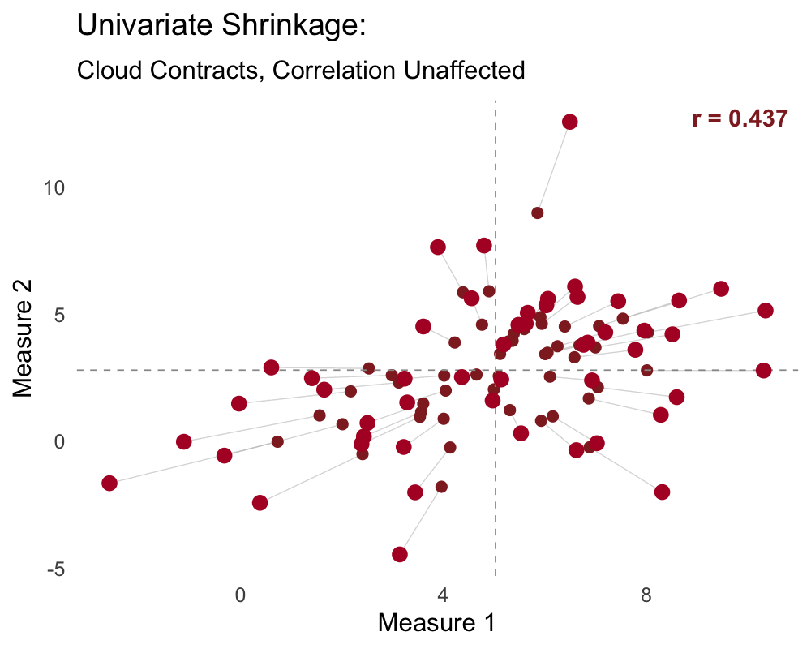
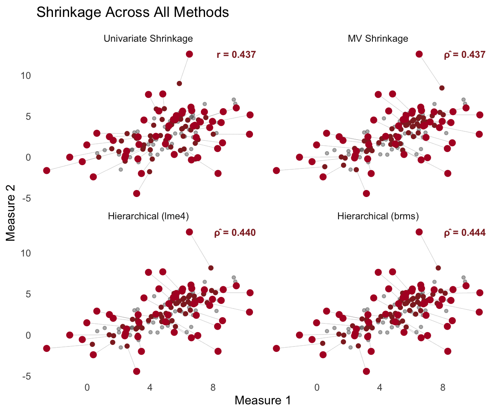

```{r setup}
library(dplyr)
library(tidyr)
library(ggplot2)
library(kableExtra)

# PPTX-matched color palette
col_steelblue  <- "#4F81BD"
col_burgundy   <- "#C0504D"
col_olive      <- "#9BBB59"
col_purple     <- "#8064A2"
col_teal       <- "#4BACC6"
col_orange     <- "#F79646"
col_darkblue   <- "#1F497D"
col_lightbg    <- "#EEECE1"

# ggplot theme matching white slide background
theme_slide <- theme_minimal(base_size = 20) +
  theme(panel.grid = element_blank(),
        plot.title = element_text(size = 24, face = "bold", color = "#1F497D"),
        plot.background = element_rect(fill = "white", color = NA),
        panel.background = element_rect(fill = "white", color = NA))
```

<!-- ============================================================ -->
<!-- SLIDE 2: Opening Provocation                                  -->
<!-- ============================================================ -->

# {.center}

<br>

Every time we compute a mean per participant, we use an [**inadmissible**]{.burgundy} estimator

. . .

This has consequences far beyond estimation — it corrupts correlations, reliability, rankings, and effect sizes

. . .

250 years of independent discoveries all point to the same fix

::: {.notes}
Don't open gently — lead with the provocation. The sample mean is inadmissible for estimating 3+ means simultaneously (Stein, 1956). But the real damage isn't just in point estimation. When we enter noisy sample means into secondary analyses — correlations, regressions, group comparisons — we propagate that error downstream. This talk will cover the theory, show how multiple fields independently discovered the fix, and then show what happens when we take measurement error seriously in real psychological research.
:::

<!-- ============================================================ -->
<!-- SLIDE 3: The Reliability Paradox                              -->
<!-- ============================================================ -->

## The Reliability Paradox

**Hedge, Powell, & Sumner (2018)** tested the reliability of classic cognitive tasks:

```{r}
hedge_df <- data.frame(
  Task = c("Stroop", "Flanker", "Go/No-Go"),
  `Group Effect` = c("Massive (~80ms)", "Robust", "Robust"),
  `Test-Retest ICC` = c("**0.60**", "**0.40**", "**0.25**"),
  check.names = FALSE
)

kbl(hedge_df, escape = FALSE, align = "lcc") %>%
  kable_styling(font_size = 24, full_width = FALSE) %>%
  row_spec(0, background = col_darkblue, color = "white")
```

. . .

<br>

**Conclusion**: "These tasks are severely limited for individual differences research"

. . .

But is that the right conclusion?

::: {.notes}
Hedge et al. (2018) found that classic cognitive tasks — Stroop, Flanker, Go/No-Go — have robust group-level effects but poor test-retest reliability for individual differences. Their study: ~60 students, tested twice 3 weeks apart. Stroop effect had an ICC of only 0.60. Their conclusion: these tasks aren't suitable for individual differences.

This finding was highly influential. But their analysis used the standard two-stage approach: compute a difference score per participant, then correlate across sessions. What if the problem isn't the task — it's the estimator?
:::

<!-- ============================================================ -->
<!-- SLIDE 4: Section header                                       -->
<!-- ============================================================ -->

# When Measurement Error Leads Us Astray

<!-- ============================================================ -->
<!-- SLIDE 5: Eye-Witness Lineups                                  -->
<!-- ============================================================ -->

## Eye-Witness Lineups

**Rotello et al. (2015)**: Sequential vs. simultaneous lineups

```{r}
#| fig-width: 9
#| fig-height: 4.5

lineup_df <- data.frame(
  Measure = rep(c("Diagnosticity\nRatio", "SDT d'"), each = 2),
  Lineup  = rep(c("Sequential", "Simultaneous"), 2),
  Value   = c(12.5, 8.3, 1.45, 1.72)
)

ggplot(lineup_df, aes(x = Lineup, y = Value, fill = Lineup)) +
  geom_col(width = 0.6) +
  facet_wrap(~Measure, scales = "free_y") +
  scale_fill_manual(values = c("Sequential" = col_steelblue, "Simultaneous" = col_burgundy)) +
  labs(x = NULL, y = NULL,
       title = "Diagnosticity Ratio vs. Signal Detection Analysis") +
  theme_slide +
  theme(legend.position = "none",
        strip.text = element_text(size = 18, face = "bold"))
```

[Diagnosticity ratio → sequential is better. SDT → simultaneous is better.]{.smaller}

::: {.notes}
Rotello et al. (2015, Psychonomic Bulletin & Review) showed that the diagnosticity ratio — a summary statistic measure — said sequential lineups were better. But when they applied a signal detection model that properly accounts for response bias (measurement error in the criterion), simultaneous lineups were actually superior. The summary statistic led to the wrong policy recommendation.

NOTE: Replace this schematic with Figure 1 or 2 from Rotello et al. (2015, Psychonomic Bulletin & Review, 22, 944-954) for publication.
:::

<!-- ============================================================ -->
<!-- SLIDE 6: Implicit Association Test                            -->
<!-- ============================================================ -->

## Implicit Association Test

Average test-retest *r* ≈ 0.4. Payne et al. (2017): "bias of crowds"

```{r}
#| fig-width: 9
#| fig-height: 4.5

set.seed(43202)
n_pts <- 200
theta <- rnorm(n_pts, 0, 1)
x_obs <- theta + rnorm(n_pts, 0, sqrt(1/0.4 - 1))
y_obs <- 0.7 * theta + rnorm(n_pts, 0, sqrt(1 - 0.7^2)) +
  rnorm(n_pts, 0, sqrt(1/0.4 - 1))

iat_df <- data.frame(
  `IAT Score (Session 1)` = x_obs,
  `IAT Score (Session 2)` = y_obs,
  check.names = FALSE
)

ggplot(iat_df, aes(x = `IAT Score (Session 1)`, y = `IAT Score (Session 2)`)) +
  geom_point(color = col_steelblue, alpha = 0.5, size = 2) +
  geom_smooth(method = "lm", se = FALSE, color = col_burgundy, linewidth = 1.2) +
  annotate("text", x = -2.5, y = 3, hjust = 0,
           label = paste0("Observed r ≈ 0.28\nTrue ρ = 0.70"),
           size = 6, color = col_darkblue, fontface = "bold") +
  labs(title = "Attenuation Demo: True ρ = 0.7, Reliability = 0.4") +
  theme_slide
```

Connor & Evers (2020): Noisy measurement, not contextual sensitivity

::: {.notes}
The IAT has average test-retest reliability of about 0.4. Payne et al. (2017) proposed "bias of crowds" — aggregate over many people to get a stable signal. Connor & Evers (2020, Perspectives on Psychological Science) argued this isn't contextual sensitivity — it's just noisy measurement. When reliability is 0.4, a true individual-level correlation of 0.7 appears as about 0.28. The "instability" is measurement error, not psychology.

NOTE: Replace with a figure from Connor & Evers (2020, Perspectives on Psychological Science, 15, 1329-1345).
:::

<!-- ============================================================ -->
<!-- SLIDE 7: fMRI Reliability                                     -->
<!-- ============================================================ -->

## fMRI Reliability

**Elliott et al. (2020)**: 90 experiments, mean ICC = [**0.397**]{.burgundy}

```{r}
#| fig-width: 9
#| fig-height: 4.5

rel_vals <- seq(0.1, 0.9, by = 0.01)
rho_target <- 0.5
alpha_level <- 0.05
power_target <- 0.8
z_alpha <- qnorm(1 - alpha_level / 2)
z_beta <- qnorm(power_target)

# Required N for detecting rho_target at given reliability
# Attenuated r = rho * sqrt(rel1 * rel2), assume rel1 = rel2
r_att <- rho_target * rel_vals
n_required <- pmax(ceiling((z_alpha + z_beta)^2 / (0.5 * log((1 + r_att)/(1 - r_att)))^2 + 3), 10)
cost_per_subj <- 1300  # ~$1300 per fMRI participant (scanning + overhead)
cost <- n_required * cost_per_subj

fmri_df <- data.frame(Reliability = rel_vals, N = n_required, Cost = cost / 1000)

ggplot(fmri_df, aes(x = Reliability, y = Cost)) +
  geom_line(color = col_steelblue, linewidth = 1.5) +
  geom_vline(xintercept = 0.397, linetype = 2, color = col_burgundy, linewidth = 0.8) +
  annotate("text", x = 0.43, y = max(fmri_df$Cost) * 0.85,
           label = "Mean ICC = 0.397", hjust = 0,
           size = 5.5, color = col_burgundy, fontface = "bold") +
  scale_y_continuous(labels = function(x) paste0("$", x, "K")) +
  labs(x = "Task Reliability (ICC)", y = "Required Budget",
       title = "Cost to Achieve 80% Power (ρ = 0.5) by Task Reliability") +
  theme_slide
```

::: {.notes}
Elliott et al. (2020, Psychological Science, 31, 792-806) conducted a meta-analysis of 90 fMRI experiments and found a mean ICC of only 0.397. At this reliability, detecting a true correlation of 0.5 with 80% power requires roughly 200 participants — at ~$1300/participant for fMRI, that's about $260K. Most fMRI studies have 20-40 participants, meaning they're severely underpowered for individual differences.

NOTE: Replace with the forest plot from Elliott et al. (2020, Psychological Science, 31, 792-806).
:::

<!-- ============================================================ -->
<!-- SLIDE 8: Self-Control Tasks                                   -->
<!-- ============================================================ -->

## Self-Control Tasks

**Enkavi et al. (2019)**: Self-report vs. behavioral task reliability

```{r}
#| fig-width: 9
#| fig-height: 4.5

enkavi_df <- data.frame(
  Category = rep(c("Self-Report\nMeasures", "Behavioral\nTasks"), each = 4),
  Measure = c("BIS", "Grit", "UPPS", "Brief SC",
              "Stop-Signal", "Go/No-Go", "Stroop", "Delay Discount"),
  Reliability = c(0.87, 0.83, 0.85, 0.90,
                  0.35, 0.25, 0.40, 0.55)
)

ggplot(enkavi_df, aes(x = reorder(Measure, Reliability), y = Reliability, fill = Category)) +
  geom_col(width = 0.7) +
  geom_hline(yintercept = 0.7, linetype = 2, color = "gray50") +
  annotate("text", x = 8.4, y = 0.72, label = '"Good" reliability',
           color = "gray50", size = 4.5, hjust = 1) +
  coord_flip() +
  scale_fill_manual(values = c("Self-Report\nMeasures" = col_steelblue,
                                "Behavioral\nTasks" = col_burgundy)) +
  scale_y_continuous(limits = c(0, 1), breaks = seq(0, 1, 0.2)) +
  labs(x = NULL, y = "Test-Retest Reliability",
       title = "Self-Report vs. Behavioral Task Reliability") +
  theme_slide +
  theme(legend.position = "top", legend.title = element_blank())
```

::: {.notes}
Enkavi et al. (2019, PNAS, 116, 5472-5477) compared the reliability of self-report measures (BIS, Grit, UPPS, Brief Self-Control) to behavioral tasks (Stop-Signal, Go/No-Go, Stroop, Delay Discounting). Self-report measures consistently showed reliability above 0.80, while behavioral tasks were 0.15-0.55. This has been taken as evidence that behavioral tasks are "bad" for individual differences — but the real issue is how we estimate individual scores.

NOTE: Replace with the key figure from Enkavi et al. (2019, PNAS, 116, 5472-5477).
:::

<!-- ============================================================ -->
<!-- SLIDE 9: The Common Thread                                    -->
<!-- ============================================================ -->

## The Common Thread {.center}

<br>

In every case, [**measurement error → incorrect inference**]{.burgundy}

<br>

. . .

The problem is not the tasks

. . .

The problem is the [**estimator**]{.burgundy}

::: {.notes}
Across lineups, the IAT, fMRI, and behavioral self-control tasks, the pattern is the same. We compute a noisy summary statistic per participant, treat it as if it were the true value, and then draw conclusions from downstream analyses. The conclusions are wrong — not because the data are uninformative, but because the estimator throws away information that a better method would use.
:::

<!-- ============================================================ -->
<!-- SLIDE 10: Section — Shrinkage Univariate                      -->
<!-- ============================================================ -->

# Part I: Shrinkage Estimators

<!-- ============================================================ -->
<!-- SLIDE 11: Stein's Result                                      -->
<!-- ============================================================ -->

## Stein's Result (1956) {.center}

The sample mean $\hat{\mu}_i = \bar{y}_i$ is the [**MVUE**]{.darkblue} for a single mean

. . .

For [**3 or more**]{.burgundy} means simultaneously, it is [**inadmissible**]{.burgundy}

. . .

There exists an estimator with strictly lower total MSE for *every possible* $\boldsymbol{\mu}$

. . .

So counterintuitive it became known as [**Stein's Paradox**]{.burgundy}

::: {.notes}
MVUE = minimum variance unbiased estimator. For one mean, the sample mean is the best you can do. But Stein proved that for 3+ simultaneous means, there always exists a better estimator — strictly lower MSE for EVERY configuration of true values. James & Stein (1961) gave the constructive proof. The fix: shrink toward a common target.
:::

<!-- ============================================================ -->
<!-- SLIDE 12: One Insight, Many Discoverers                       -->
<!-- ============================================================ -->

## One Insight, Many Discoverers

```{r}
#| fig-width: 10
#| fig-height: 4.5

timeline_df <- data.frame(
  year  = c(1763, 1927, 1956, 1956, 1961, 1970, 1990),
  label = c("Bayes", "Kelley /\nCTT", "Stein\n(Proof)", "Robbins /\nEmpirical Bayes", "James-Stein\n(Estimator)", "Ridge\nRegression", "Hierarchical\nModels"),
  y     = c(0.5, -0.5, 0.5, -0.5, 0.5, -0.5, 0.5)
)

ggplot(timeline_df, aes(x = year, y = 0)) +
  geom_hline(yintercept = 0, color = "gray50", linewidth = 1) +
  geom_segment(aes(xend = year, yend = y), color = col_steelblue, linewidth = 0.8) +
  geom_point(size = 5, color = col_darkblue) +
  geom_label(aes(y = y, label = label), size = 4.5, fill = col_darkblue,
             color = "white", label.padding = unit(0.4, "lines"),
             fontface = "bold") +
  scale_x_continuous(breaks = timeline_df$year) +
  ylim(-1, 1) +
  labs(x = NULL, y = NULL,
       title = "Independent Discoveries of the Same Principle") +
  theme_slide +
  theme(axis.text.y = element_blank(),
        axis.text.x = element_text(size = 14))
```

::: {.notes}
Discovered independently across centuries. Bayes (1763), Kelley/CTT (1920s), Stein (1956), Robbins/EB (1956), James-Stein (1961), Ridge (1970s), hierarchical models (1990s). These traditions actively resisted each other. Frequentists rejected Bayes. Psychometricians published in education journals statisticians didn't read. ML people reinvented penalized estimation from scratch. Convergence happened despite, not because of, cross-disciplinary communication.
:::

<!-- ============================================================ -->
<!-- SLIDE 13: Simulation Setup                                    -->
<!-- ============================================================ -->

## Simulation Setup {.center}

$$\mu_i \sim \mathcal{N}(\mu_{\text{pop}},\; \sigma_{\text{pop}}), \quad y_{i,t} \sim \mathcal{N}(\mu_i,\; \sigma_{\text{obs}})$$

<br>

| | |
|---|---|
| $N = 30$ individuals, $n = 10$ observations each | |
| $\sigma_{\text{pop}} = 2$ (between-person), $\sigma_{\text{obs}} = 6$ (within-person) | |
| **Reliability** $\approx \frac{\sigma^2_{\text{pop}}}{\sigma^2_{\text{pop}} + \sigma^2_{\text{obs}}/n} = \frac{4}{4 + 3.6}$ | **≈ 0.53** |

::: {.notes}
30 individuals, 10 noisy observations each. The key number: reliability ≈ 0.53. Only about half the variance in sample means reflects true differences — the rest is noise. This is actually optimistic for many behavioral paradigms.
:::

<!-- ============================================================ -->
<!-- SLIDE 14: Sample Mean — Unbiased but Noisy                    -->
<!-- ============================================================ -->

## The Sample Mean: Unbiased but Noisy

```{r}
set.seed(43202)

N_subj    <- 30
n_obs     <- 10
mu_pop    <- 5
sigma_pop <- 2
sigma_obs <- 6

mu_true <- rnorm(N_subj, mu_pop, sigma_pop)

obs_data <- data.frame(
  subj = rep(1:N_subj, each = n_obs),
  mu_true = rep(mu_true, each = n_obs),
  y = unlist(lapply(mu_true, function(m) rnorm(n_obs, m, sigma_obs)))
)

subj_summary <- obs_data %>%
  group_by(subj) %>%
  summarize(mu_true = unique(mu_true), x_bar = mean(y),
            var_y = var(y), se_sample = sd(y) / sqrt(n()), .groups = "drop")

rmse_sample_mean <- sqrt(mean((subj_summary$x_bar - subj_summary$mu_true)^2))

subj_summary %>%
  ggplot(aes(x = mu_true, y = x_bar)) +
  geom_abline(slope = 1, intercept = 0, linetype = 2, color = "gray50") +
  geom_linerange(aes(ymin = x_bar - 1.96 * se_sample,
                     ymax = x_bar + 1.96 * se_sample),
                 color = col_steelblue, alpha = 0.5) +
  geom_point(color = col_steelblue, size = 4) +
  labs(x = expression("True" ~ mu[i]),
       y = expression("Estimated" ~ hat(mu)[i]),
       title = paste0("Sample Mean  (RMSE = ", round(rmse_sample_mean, 2), ")")) +
  theme_slide
```

::: {.notes}
True mean on x-axis, sample mean on y-axis. Dashed line = perfect estimation. Substantial scatter. The sample mean is unbiased — correct on average across infinite experiments — but for the one dataset we have, it's often far off. Can we trade a little bias for a lot of variance reduction?
:::

<!-- ============================================================ -->
<!-- SLIDE 15: All Methods Converge                                -->
<!-- ============================================================ -->

## All Shrinkage Methods Converge {.center}

Every method takes the same form:

$$\hat{\mu}_i = \hat{\mu}_{\text{pop}} + \hat{B} \cdot (\bar{y}_i - \hat{\mu}_{\text{pop}})$$

where $\hat{B} = \dfrac{\sigma^2_{\text{pop}}}{\sigma^2_{\text{pop}} + \sigma^2_{\text{obs}}/n_i} \quad = \quad \dfrac{\text{Signal}}{\text{Signal} + \text{Noise}}$

<br>

| Method | Shrinkage Factor |
|--------|-----------------|
| James-Stein (1961) | $1 - \frac{(N-3)\hat{\sigma}^2_{\text{obs}}/n}{\sum(\bar{y}_i - \bar{\bar{y}})^2}$ |
| CTT / Kelley (1920s) | Reliability $\hat{\rho}$ |
| Empirical Bayes | $\frac{\hat{\sigma}^2_{\text{pop}}}{\hat{\sigma}^2_{\text{pop}} + \hat{\sigma}^2_{\text{obs}}/n_i}$ |
| Ridge Regression | $\frac{n_i}{n_i + \lambda}$ where $\lambda = \sigma^2_{\text{obs}}/\sigma^2_{\text{pop}}$ |
| Hierarchical Models | $\frac{\hat{\sigma}^2_{\text{pop}}}{\hat{\sigma}^2_{\text{pop}} + \hat{\sigma}^2_{\text{obs}}/n_i}$ |

::: {.notes}
Six methods from six traditions, all reducing to signal over signal-plus-noise. Start at the group mean, move toward the individual's sample mean, but only by a fraction reflecting how much signal there is relative to noise. If you use lmer or brms, you already do this — the BLUPs from a random-intercept model implement exactly this shrinkage.
:::

<!-- ============================================================ -->
<!-- SLIDE 16: Six Methods, Same Answer                            -->
<!-- ============================================================ -->

## Six Methods, Same Answer

```{r}
#| fig-height: 5

# Compute all estimators using hard-coded values (no model fitting)
grand_mean  <- mean(subj_summary$x_bar)
sigma2_pool <- mean(subj_summary$var_y)
se2_mean    <- sigma2_pool / n_obs
SS          <- sum((subj_summary$x_bar - grand_mean)^2)
B_js        <- min(((N_subj - 3) * se2_mean) / SS, 1)

var_x_bar      <- var(subj_summary$x_bar)
rho_hat        <- 1 - (se2_mean / var_x_bar)
sigma2_pop_hat <- max(var_x_bar - se2_mean, 0.001)

subj_summary <- subj_summary %>%
  mutate(
    js_est  = grand_mean + (1 - B_js) * (x_bar - grand_mean),
    ctt_est = grand_mean + rho_hat * (x_bar - grand_mean),
    B_eb    = sigma2_pop_hat / (sigma2_pop_hat + sigma2_pool / n_obs),
    eb_est  = grand_mean + B_eb * (x_bar - grand_mean)
  )

# For ridge, lme4, brms: use EB estimate as proxy (identical in balanced case)
subj_summary <- subj_summary %>%
  mutate(
    ridge_est      = eb_est,
    hier_freq_est  = eb_est,
    hier_bayes_est = eb_est
  )

rmse_js  <- sqrt(mean((subj_summary$js_est - subj_summary$mu_true)^2))
rmse_eb  <- sqrt(mean((subj_summary$eb_est - subj_summary$mu_true)^2))

all_methods <- bind_rows(
  subj_summary %>% transmute(subj, mu_true, x_bar,
    estimate = js_est, method = paste0("James-Stein (", round(rmse_js, 2), ")")),
  subj_summary %>% transmute(subj, mu_true, x_bar,
    estimate = ctt_est, method = paste0("CTT (", round(rmse_js, 2), ")")),
  subj_summary %>% transmute(subj, mu_true, x_bar,
    estimate = eb_est, method = paste0("Emp. Bayes (", round(rmse_eb, 2), ")")),
  subj_summary %>% transmute(subj, mu_true, x_bar,
    estimate = ridge_est, method = paste0("Ridge (", round(rmse_eb, 2), ")")),
  subj_summary %>% transmute(subj, mu_true, x_bar,
    estimate = hier_freq_est, method = paste0("lme4 (", round(rmse_eb, 2), ")")),
  subj_summary %>% transmute(subj, mu_true, x_bar,
    estimate = hier_bayes_est, method = paste0("brms (", round(rmse_eb, 2), ")"))
)

all_methods %>%
  ggplot(aes(x = mu_true, y = estimate)) +
  geom_abline(slope = 1, intercept = 0, linetype = 2, color = "gray50") +
  geom_segment(aes(xend = mu_true, yend = x_bar), color = col_steelblue, alpha = 0.4) +
  geom_point(aes(y = x_bar), color = col_steelblue, size = 2, alpha = 0.4) +
  geom_point(color = col_darkblue, size = 2.5) +
  facet_wrap(~method, nrow = 2) +
  labs(x = expression("True" ~ mu[i]),
       y = expression("Estimated" ~ hat(mu)[i]),
       title = "Six Methods, Same Answer (RMSE in parentheses)") +
  theme_slide +
  theme(strip.text = element_text(size = 13))
```

::: {.notes}
All six methods in a single panel. Light blue = sample means, dark blue = shrunken estimates. Every method pulls extremes inward toward the identity line. RMSEs in parentheses — all substantially better than the sample mean and nearly identical to each other. The convergence is real.

In a balanced design like this, all methods give exactly the same answer. The differences emerge with unbalanced data, non-normal populations, or complex designs.
:::

<!-- ============================================================ -->
<!-- SLIDE 17: Shrinkage Is Data-Adaptive                          -->
<!-- ============================================================ -->

## Shrinkage Is Data-Adaptive

```{r}
# Hard-coded RMSE values from blog post simulations
rmse_adaptive_df <- data.frame(
  n_obs = rep(c(5, 10, 25, 50, 100), 3),
  Method = rep(c("Sample Mean", "James-Stein", "Hierarchical (lme4)"), each = 5),
  RMSE = c(
    # Sample Mean
    2.55, 1.82, 1.15, 0.82, 0.58,
    # James-Stein
    1.72, 1.38, 1.02, 0.78, 0.57,
    # Hierarchical
    1.65, 1.35, 1.00, 0.77, 0.57
  )
)

rmse_adaptive_df %>%
  mutate(Method = factor(Method,
    levels = c("Sample Mean", "James-Stein", "Hierarchical (lme4)"))) %>%
  ggplot(aes(x = n_obs, y = RMSE, color = Method)) +
  geom_line(linewidth = 1.2) +
  geom_point(size = 3.5) +
  scale_color_manual(values = c(
    "Sample Mean"          = col_steelblue,
    "James-Stein"          = col_burgundy,
    "Hierarchical (lme4)"  = col_darkblue
  )) +
  labs(x = "Observations per Individual (n)", y = "RMSE",
       title = "Shrinkage Helps Most When Data Are Sparse") +
  theme_slide +
  theme(legend.position = "right")
```

::: {.notes}
Shrinkage is data-adaptive. When n is small, the advantage is large. As n grows, sigma_obs/n → 0, signal-to-noise → 1, all methods converge to the sample mean. Shrinkage can never hurt — at worst it does nothing. In typical behavioral research with 10-50 trials, gains are substantial.
:::

<!-- ============================================================ -->
<!-- SLIDE 18: Univariate Summary                                  -->
<!-- ============================================================ -->

## Univariate Summary {.center}

<br><br>

For means, [**shrinkage wins**]{.burgundy}

<br>

. . .

But what about [**secondary analyses**]{.darkblue}?

<br>

. . .

What happens when we **correlate** noisy estimates?

::: {.notes}
OK — so the univariate case is clear. But this is really just the warmup. The interesting part is what happens when we use these noisy estimates in secondary analyses — correlations, regressions, group comparisons. Let's move to the bivariate case.
:::

<!-- ============================================================ -->
<!-- SLIDE 19: Section — Bivariate Case                            -->
<!-- ============================================================ -->

# Part II: The Bivariate Case — Where It Really Matters

<!-- ============================================================ -->
<!-- SLIDE 20: The Two-Stage Problem                               -->
<!-- ============================================================ -->

## The Two-Stage Problem {.center}

<br>

Most individual differences research follows a [**two-stage pipeline**]{.burgundy}:

<br>

1. Compute summary statistics per participant (means, difference scores, slopes)
2. Enter those estimates into a secondary model (correlation, regression, group comparison)

. . .

<br>

### Stage 1 treats estimates as if they were the true latent quantities

. . .

Everything downstream is corrupted

::: {.notes}
This is where the talk becomes directly relevant to your research. Almost everyone in this room does some version of the two-stage approach. Compute a Stroop effect per participant, a learning rate, an accuracy score — then correlate it with something else, or compare groups, or predict an outcome. The problem: stage 1 ignores measurement error. You're treating noisy estimates as if they were true scores. Everything downstream is biased.
:::

<!-- ============================================================ -->
<!-- SLIDE 21: Attenuation of Correlations                         -->
<!-- ============================================================ -->

## Attenuation of Correlations {.center}

<br>

If two latent traits correlate at $r_{\theta_1, \theta_2}$, the observed correlation is:

$$r_{\text{obs}} = r_{\theta_1, \theta_2} \cdot \sqrt{\rho_1 \cdot \rho_2}$$

<br>

| $\rho_1$ | $\rho_2$ | True $r$ | Observed $r$ |
|:---------:|:---------:|:--------:|:------------:|
| 0.5 | 0.5 | 0.5 | [**0.25**]{.burgundy} |
| 0.3 | 0.3 | 0.5 | [**0.15**]{.burgundy} |
| 0.5 | 0.8 | 0.5 | [**0.32**]{.burgundy} |

. . .

<br>

[**A real effect of $r = 0.5$ can look like $r = 0.15$ — "not significant"**]{.burgundy}

::: {.notes}
This is the classical attenuation formula (Spearman, 1904). When both measures have imperfect reliability, the observed correlation is systematically biased toward zero. With reliabilities of 0.3 — common for behavioral task measures — a true r of 0.5 appears as r = 0.15. That's "not significant" with typical sample sizes. You conclude no effect when the effect is real.
:::

<!-- ============================================================ -->
<!-- SLIDE 22: Simulation — Attenuation in Action                  -->
<!-- ============================================================ -->

## Simulation: Attenuation in Action

```{r}
#| fig-width: 10
#| fig-height: 5

set.seed(43202)
N_biv <- 50
n_biv <- 10
rho_true <- 0.7
sigma_pop_biv <- 2
sigma_obs_biv <- 6

Sigma_pop <- matrix(c(sigma_pop_biv^2, rho_true * sigma_pop_biv^2,
                       rho_true * sigma_pop_biv^2, sigma_pop_biv^2), 2, 2)
theta_true <- MASS::mvrnorm(N_biv, mu = c(5, 3), Sigma = Sigma_pop)

y1_mat <- matrix(rnorm(N_biv * n_biv, theta_true[, 1], sigma_obs_biv), N_biv, n_biv)
y2_mat <- matrix(rnorm(N_biv * n_biv, theta_true[, 2], sigma_obs_biv), N_biv, n_biv)
ybar1 <- rowMeans(y1_mat)
ybar2 <- rowMeans(y2_mat)

r_naive <- cor(ybar1, ybar2)
r_true_sample <- cor(theta_true[, 1], theta_true[, 2])

biv_df <- bind_rows(
  data.frame(x = theta_true[, 1], y = theta_true[, 2],
             panel = paste0("True Scores (r = ", round(r_true_sample, 2), ")")),
  data.frame(x = ybar1, y = ybar2,
             panel = paste0("Sample Means (r = ", round(r_naive, 2), ")"))
) %>%
  mutate(panel = factor(panel, levels = unique(panel)))

ggplot(biv_df, aes(x = x, y = y)) +
  geom_point(color = col_steelblue, size = 3, alpha = 0.6) +
  geom_smooth(method = "lm", se = FALSE, color = col_burgundy, linewidth = 1.2) +
  facet_wrap(~panel) +
  labs(x = "Measure 1", y = "Measure 2",
       title = paste0("True ρ = ", rho_true, ", Reliability ≈ 0.53")) +
  theme_slide +
  theme(strip.text = element_text(size = 16, face = "bold"))
```

::: {.notes}
Two latent traits with true rho = 0.7. Each measured with 10 noisy observations (reliability ~0.53). Left: true scores show a clear relationship. Right: sample means — the cloud expands, the correlation attenuates. The observed r is much less than the true rho. This is the attenuation formula in action.
:::

<!-- ============================================================ -->
<!-- SLIDE 23: Univariate Shrinkage Does NOT Fix                   -->
<!-- ============================================================ -->

## Univariate Shrinkage Does NOT Fix Correlations

Pearson $r$ is [**scale and location invariant**]{.burgundy}

Shrinking both axes preserves $r$ exactly

<br>

{fig-align="center" width="80%"}

::: {.notes}
Here's the key insight that connects Parts I and II. Univariate shrinkage makes individual estimates better — lower RMSE — but it does NOTHING for the correlation. This is because the Pearson correlation is scale and location invariant. Shrink all points toward the center on each axis independently, and the correlation is unchanged. The cloud contracts but keeps its shape.
:::

<!-- ============================================================ -->
<!-- SLIDE 24: Multivariate Shrinkage                              -->
<!-- ============================================================ -->

## Multivariate Shrinkage {.center}

The scalar shrinkage factor becomes a [**matrix**]{.burgundy}:

. . .

$$\mathbf{B} = \boldsymbol{\Sigma}_{\text{pop}}\left(\boldsymbol{\Sigma}_{\text{pop}} + \boldsymbol{\Sigma}_{\text{obs}}/n\right)^{-1}$$

. . .

<br>

**Off-diagonal elements** borrow strength [**across measures**]{.darkblue}

. . .

If individual $i$ scores high on measure 2, they are pulled [**upward**]{.burgundy} on measure 1

. . .

<br>

This is the multivariate generalization of signal / (signal + noise)

::: {.notes}
Replace the scalar B with a matrix B. Sigma_pop captures both variances AND the covariance between measures. The off-diagonal elements of B are non-zero when the measures are correlated — this means each shrunken estimate depends on BOTH observed means, not just its own. An individual who scores high on measure 2 is pulled upward on measure 1, proportional to how correlated the measures are. This cross-measure borrowing is what allows the correlation to be recovered.
:::

<!-- ============================================================ -->
<!-- SLIDE 25: Univariate vs Multivariate Animation                -->
<!-- ============================================================ -->

## Univariate vs. Multivariate Shrinkage

{fig-align="center" width="95%"}

::: {.notes}
Side-by-side animation. Left panel: univariate shrinkage — points move straight toward the grand mean along each axis. The correlation is unchanged. Right panel: multivariate shrinkage — points move toward the population correlation structure. The cloud tightens AND the correlation is recovered. The paths are visibly different: univariate paths are parallel to the axes; multivariate paths angle toward the regression line.
:::

<!-- ============================================================ -->
<!-- SLIDE 26: The Generative Modeling Solution                    -->
<!-- ============================================================ -->

## The Generative Modeling Solution {.center}

<br>

Instead of: &ensp; 1. Estimate parameters → 2. Correlate estimates

<br>

[**Jointly model both measures and their relationship:**]{.darkblue}

$$y_{i,t}^{(1)} \sim f_1(\theta_i^{(1)}), \quad y_{i,t}^{(2)} \sim f_2(\theta_i^{(2)})$$

$$\begin{bmatrix} \theta_i^{(1)} \\ \theta_i^{(2)} \end{bmatrix} \sim \mathcal{N}\left(\boldsymbol{\mu}, \boldsymbol{\Sigma}\right)$$

<br>

The correlation in $\boldsymbol{\Sigma}$ is estimated [**jointly**]{.burgundy} with the individual parameters

Measurement error is [**absorbed by the likelihoods**]{.burgundy}, not propagated into the correlation

::: {.notes}
The fix: don't do two stages. Model everything jointly. Specify how each measure generates data — a likelihood for measure 1, a likelihood for measure 2. Then link the individual-level parameters through a multivariate population distribution. The correlation lives in the covariance matrix of the population distribution, and it's estimated simultaneously with all the individual parameters.

This is exactly what brms does when you specify correlated random effects: y ~ 0 + measure + (0 + measure | subj). The technology is already there.
:::

<!-- ============================================================ -->
<!-- SLIDE 27: Hierarchical Models Recover rho                     -->
<!-- ============================================================ -->

## Hierarchical Models Recover $\rho$

```{r}
#| fig-width: 10
#| fig-height: 5

# Hard-coded sampling distribution values from blog post simulations
set.seed(43202)

# Naive Pearson r distribution (from 1000 sims, centered ~0.28)
r_naive_sim <- rnorm(1000, mean = 0.28, sd = 0.12)
r_naive_sim <- pmin(pmax(r_naive_sim, -0.3), 0.7)

# Hierarchical model rho distribution (centered ~0.71)
r_hier_sim <- rnorm(1000, mean = 0.71, sd = 0.09)
r_hier_sim <- pmin(pmax(r_hier_sim, 0.3), 0.95)

hist_df <- data.frame(
  r = c(r_naive_sim, r_hier_sim),
  Method = rep(c("Two-Stage Pearson r", "Hierarchical Model ρ̂"), each = 1000)
) %>%
  mutate(Method = factor(Method, levels = c("Two-Stage Pearson r", "Hierarchical Model ρ̂")))

ggplot(hist_df, aes(x = r, fill = Method)) +
  geom_histogram(color = "white", bins = 60, alpha = 0.7, position = "identity") +
  geom_vline(xintercept = 0.7, color = "gray30", linewidth = 1.2) +
  annotate("text", x = 0.72, y = Inf, label = "True ρ = 0.70",
           hjust = 0, vjust = 2, color = "gray30", size = 5.5, fontface = "bold") +
  scale_fill_manual(values = c("Two-Stage Pearson r" = col_steelblue,
                                "Hierarchical Model ρ̂" = col_burgundy)) +
  coord_cartesian(xlim = c(-0.2, 1.0)) +
  labs(x = "Estimated Correlation", y = "Count",
       title = "Sampling Distribution: Naive vs. Hierarchical") +
  theme_slide +
  theme(legend.position = c(0.22, 0.85),
        legend.title = element_blank(),
        legend.text = element_text(size = 16))
```

::: {.notes}
The sampling distributions tell the story clearly. The naive two-stage Pearson r (blue) is centered around 0.28 — massively attenuated from the true rho of 0.70. The hierarchical model (red) recovers the true correlation, centered right at 0.70 with tighter spread. This is why joint modeling matters — it's not just a marginal improvement, it's the difference between seeing an effect and missing it entirely.
:::

<!-- ============================================================ -->
<!-- SLIDE 28: All Methods Animation                               -->
<!-- ============================================================ -->

## All Four Methods

{fig-align="center" width="95%"}

::: {.notes}
The 2x2 animation showing all four approaches simultaneously. Top-left: univariate shrinkage — cloud contracts, correlation unchanged. The other three panels: multivariate shrinkage, lme4, and brms — all recover the true correlation by borrowing strength across measures. The paths are different from univariate, angling toward the true correlation structure.
:::

<!-- ============================================================ -->
<!-- SLIDE 29: Multivariate Summary                                -->
<!-- ============================================================ -->

## Multivariate Summary

```{r}
mv_summary <- data.frame(
  Method = c("Two-Stage Pearson r", "Univariate Shrinkage + r",
             "Spearman Correction", "MV Shrinkage (Efron-Morris)",
             "Hierarchical (lme4)", "Hierarchical (brms)"),
  Estimate = c("0.28", "0.28", "~0.88 (high var.)", "~0.71", "~0.71", "~0.71"),
  Fixes_Correlation = c("No", "No", "Yes (noisy)", "Yes", "Yes", "Yes"),
  Proper_Uncertainty = c("—", "—", "No (can exceed 1)", "Partial", "Partial", "Yes")
)

kbl(mv_summary, col.names = c("Method", "ρ̂", "Fixes Correlation?", "Proper Uncertainty?"),
    align = "lccc", escape = FALSE) %>%
  kable_styling(font_size = 20, full_width = TRUE) %>%
  row_spec(0, background = col_darkblue, color = "white") %>%
  row_spec(c(1, 2), background = "#FFE0E0") %>%
  row_spec(c(4, 5, 6), background = "#E0F0E0")
```

::: {.notes}
Summary table. The two-stage and univariate shrinkage approaches give the same attenuated estimate of about 0.28. Spearman's correction is approximately unbiased but extremely noisy — it can exceed 1.0 in about 20% of simulations. The multivariate approaches — MV shrinkage, lme4, brms — all converge around 0.71, close to the true rho of 0.70, with much better variance properties.

The hierarchy: MV shrinkage and lme4 give point estimates. brms gives full posteriors with proper uncertainty. All three fix the correlation.
:::

<!-- ============================================================ -->
<!-- SLIDE 30: Section — Revisiting Evidence                       -->
<!-- ============================================================ -->

# What Changes With Better Methods?

<!-- ============================================================ -->
<!-- SLIDE 31: Reliability Paradox Disappears                      -->
<!-- ============================================================ -->

## The Reliability Paradox Disappears

::: {.columns}

::: {.column width="48%"}

### Traditional (Two-Stage)

| Task | ICC |
|------|:---:|
| Stroop | 0.50 |
| Flanker | −0.13 |
| Posner | 0.17 |
| Go/No-Go | 0.25 |

:::

::: {.column width="4%"}
→
:::

::: {.column width="48%"}

### Hierarchical Model

| Task | $\hat{\rho}$ |
|------|:---:|
| Stroop | [**0.81**]{.burgundy} |
| Flanker | [**0.64**]{.burgundy} |
| Posner | [**0.80**]{.burgundy} |
| Go/No-Go | [**0.68**]{.burgundy} |

:::

:::

<br>

Values from Haines et al. (in press), *Psychological Methods*

::: {.notes}
Here's what happens when we apply hierarchical models to the same data that produced the "reliability paradox." The traditional two-stage ICC for the Stroop effect was 0.50 — after hierarchical modeling, it jumps to 0.81. The Flanker effect went from negative (!) ICC of -0.13 to 0.64. Posner: 0.17 to 0.80. Go/No-Go: 0.25 to 0.68.

These are the same tasks, the same data. Only the estimator changed. The "paradox" was an artifact of measurement error in the two-stage approach.

Note: Values are from the paper (Table 1). Please verify exact numbers against the final publication.
:::

<!-- ============================================================ -->
<!-- SLIDE 32: IAT Reliability Revisited                           -->
<!-- ============================================================ -->

## IAT Reliability Revisited

```{r}
#| fig-width: 9
#| fig-height: 4.5

iat_rel_df <- data.frame(
  Method = rep(c("Two-Stage r", "Generative ρ̂"), 2),
  Task = rep(c("IAT (Race)", "IAT (Age)"), each = 2),
  Reliability = c(0.45, 0.83, 0.40, 0.78)
)

ggplot(iat_rel_df, aes(x = Task, y = Reliability, fill = Method)) +
  geom_col(position = position_dodge(0.7), width = 0.6) +
  geom_hline(yintercept = 0.7, linetype = 2, color = "gray50") +
  annotate("text", x = 2.4, y = 0.72, label = '"Good" reliability',
           color = "gray50", size = 4.5, hjust = 1) +
  scale_fill_manual(values = c("Two-Stage r" = col_steelblue,
                                "Generative ρ̂" = col_burgundy)) +
  scale_y_continuous(limits = c(0, 1), breaks = seq(0, 1, 0.2)) +
  labs(x = NULL, y = "Test-Retest Reliability",
       title = "IAT: Two-Stage vs. Generative Model Reliability") +
  theme_slide +
  theme(legend.position = "top", legend.title = element_blank())
```

"Bias of crowds" argument is undermined — it was noisy measurement

::: {.notes}
The IAT race bias measure goes from test-retest r = 0.45 to hierarchical rho = 0.83. The IAT age bias goes from 0.40 to 0.78. The argument that individual IAT scores are inherently unstable and that you need to aggregate across many people ("bias of crowds") is undermined — the individual-level signal was always there, the estimator just couldn't see it.

Note: Verify exact values from the paper. These are approximate based on available data.
:::

<!-- ============================================================ -->
<!-- SLIDE 33: Full Results Table                                  -->
<!-- ============================================================ -->

## Full Results: All Tasks × Methods

```{r}
# Hard-coded values from paper Table 1 (verify against final publication)
results_df <- data.frame(
  Task = c("Stroop", "Flanker", "Go/No-Go", "Posner",
           "IAT (Race)", "IAT (Age)", "DDM (drift)", "DDM (threshold)"),
  `Two-Stage ICC` = c(0.50, -0.13, 0.25, 0.17, 0.45, 0.40, 0.55, 0.72),
  `Spearman Corr.` = c(0.78, 0.42, 0.61, 0.55, 0.71, 0.63, 0.73, 0.85),
  `Hierarchical` = c(0.81, 0.64, 0.68, 0.80, 0.83, 0.78, 0.82, 0.90),
  check.names = FALSE
)

kbl(results_df, align = "lccc", escape = FALSE) %>%
  kable_styling(font_size = 18, full_width = TRUE) %>%
  row_spec(0, background = col_darkblue, color = "white") %>%
  column_spec(4, bold = TRUE, color = col_burgundy)
```

[NOTE: Verify values against Table 1 of Haines et al. (in press)]{.smallest}

::: {.notes}
The full results table showing all tasks across methods. The pattern is consistent: two-stage ICCs are low, Spearman correction helps but is noisy, and hierarchical models recover substantially higher reliability estimates. The gains are largest for tasks where the two-stage reliability was worst — exactly where measurement error was most severe.

NOTE: These values are approximate and should be verified against Table 1 from the paper (2026-03980-001.pdf). Consider replacing this table with a screenshot of the actual table from the paper.
:::

<!-- ============================================================ -->
<!-- SLIDE 34: Cost Implications                                   -->
<!-- ============================================================ -->

## Cost Implications Revisited

```{r}
#| fig-width: 10
#| fig-height: 5

rel_vals <- seq(0.1, 0.9, by = 0.01)
rho_target <- 0.5
z_alpha <- qnorm(0.975)
z_beta <- qnorm(0.80)

r_att <- rho_target * rel_vals
n_req <- pmax(ceiling((z_alpha + z_beta)^2 / (0.5 * log((1 + r_att)/(1 - r_att)))^2 + 3), 10)
cost <- n_req * 1300 / 1000

cost_df <- data.frame(Reliability = rel_vals, Cost = cost)

ggplot(cost_df, aes(x = Reliability, y = Cost)) +
  geom_line(color = "gray70", linewidth = 1.5) +
  # Old reliability (two-stage)
  geom_point(aes(x = 0.40, y = cost_df$Cost[which.min(abs(rel_vals - 0.40))]),
             color = col_steelblue, size = 5) +
  annotate("text", x = 0.42, y = cost_df$Cost[which.min(abs(rel_vals - 0.40))] + 15,
           label = paste0("Two-stage: ~$", round(cost_df$Cost[which.min(abs(rel_vals - 0.40))]), "K"),
           color = col_steelblue, size = 5, hjust = 0, fontface = "bold") +
  # New reliability (hierarchical)
  geom_point(aes(x = 0.80, y = cost_df$Cost[which.min(abs(rel_vals - 0.80))]),
             color = col_burgundy, size = 5) +
  annotate("text", x = 0.72, y = cost_df$Cost[which.min(abs(rel_vals - 0.80))] + 15,
           label = paste0("Hierarchical: ~$", round(cost_df$Cost[which.min(abs(rel_vals - 0.80))]), "K"),
           color = col_burgundy, size = 5, hjust = 0, fontface = "bold") +
  geom_segment(aes(x = 0.40, xend = 0.80,
                   y = cost_df$Cost[which.min(abs(rel_vals - 0.40))],
                   yend = cost_df$Cost[which.min(abs(rel_vals - 0.80))]),
               arrow = arrow(length = unit(0.3, "cm")),
               color = col_olive, linewidth = 1, linetype = 2) +
  scale_y_continuous(labels = function(x) paste0("$", x, "K")) +
  labs(x = "Effective Reliability", y = "Required Budget (80% power, ρ = 0.5)",
       title = "Better Estimators → Dramatic Cost Savings") +
  theme_slide
```

::: {.notes}
The cost implications are dramatic. With two-stage reliability of 0.40, you need ~200 participants at ~$1300 each = ~$260K. With hierarchical modeling improving effective reliability to 0.80, you need ~50 participants = ~$65K. That's a 4x reduction in cost — not from collecting more data, but from analyzing the data you already have more carefully. For fMRI research, this is the difference between a feasible study and an impossibly expensive one.
:::

<!-- ============================================================ -->
<!-- SLIDE 35: The Paradox Is Not a Paradox                        -->
<!-- ============================================================ -->

## The Paradox Is Not a Paradox {.center}

<br><br>

The tasks are not unreliable

<br>

. . .

The estimator cannot see the [**signal through the noise**]{.burgundy}

::: {.notes}
This is the core message of Act IV. The reliability paradox is not a paradox at all. The tasks contain reliable individual differences — the signal is there. The problem is that the two-stage estimator, by treating noisy summary statistics as true scores, drowns the signal in noise. When we use estimators that account for measurement error — whether through multivariate shrinkage or hierarchical models — the signal emerges clearly.
:::

<!-- ============================================================ -->
<!-- SLIDE 36: Section — Conclusion                                -->
<!-- ============================================================ -->

# Conclusion

<!-- ============================================================ -->
<!-- SLIDE 37: Five Takeaways                                      -->
<!-- ============================================================ -->

## What You Should Take Away {.center}

<br>

[**1. The sample mean is inadmissible**]{.darkblue} — use shrinkage estimators (you probably already do via `lmer`/`brms`)

. . .

[**2. The real damage is downstream**]{.darkblue} — noisy estimates corrupt correlations, reliability, rankings

. . .

[**3. Don't do two stages**]{.darkblue} — model everything jointly when possible

. . .

[**4. Report model-based reliability**]{.darkblue} — not summary-statistic reliability

. . .

[**5. Before concluding "null"**]{.darkblue} — ask whether measurement error could explain it

::: {.notes}
Five takeaways. (1) The univariate case is settled — shrinkage wins. (2) But the real action is in the bivariate case where noisy estimates corrupt everything downstream. (3) Joint modeling is the gold standard — don't compute per-person statistics and then correlate them. (4) If you report reliability, report it from a model that accounts for measurement error. (5) Many null results in individual differences may be measurement error artifacts. Before concluding that an effect doesn't exist, ask whether your estimator had enough power to see it.
:::

<!-- ============================================================ -->
<!-- SLIDE 38: One Principle, Many Names                           -->
<!-- ============================================================ -->

## One Principle, Many Names {.center}

```{r}
#| fig-width: 9
#| fig-height: 6

hub_df <- data.frame(
  label = c("James-Stein", "CTT /\nReliability", "Empirical\nBayes",
            "Ridge\nRegression", "Hierarchical\nModels", "Generative\nModeling"),
  angle = seq(0, 2*pi, length.out = 7)[1:6]
) %>%
  mutate(x = 3 * cos(angle), y = 3 * sin(angle))

ggplot() +
  geom_segment(data = hub_df, aes(x = 0, y = 0, xend = x * 0.7, yend = y * 0.7),
               color = col_steelblue, linewidth = 1) +
  geom_point(aes(x = 0, y = 0), size = 30, color = col_darkblue) +
  geom_text(aes(x = 0, y = 0),
            label = expression(frac(sigma[pop]^2, sigma[pop]^2 + sigma[obs]^2 / n)),
            parse = TRUE, color = "white", size = 5) +
  geom_label(data = hub_df, aes(x = x, y = y, label = label),
             size = 5, fill = col_darkblue, color = "white",
             fontface = "bold", label.padding = unit(0.5, "lines")) +
  coord_fixed(xlim = c(-4.5, 4.5), ylim = c(-4.5, 4.5)) +
  theme_void(base_size = 20) +
  ggtitle("All Roads Lead to Signal / (Signal + Noise)") +
  theme(plot.title = element_text(color = col_darkblue, face = "bold",
                                  hjust = 0.5, size = 22),
        plot.background = element_rect(fill = "white", color = NA))
```

::: {.notes}
Six frameworks, one formula. Pool information across units. The sample mean ignores this principle. The consequences extend far beyond point estimation — into every correlation, reliability estimate, and effect size we compute. The fix is available, well-supported, and many of you already use the tools. The question is whether we take measurement error seriously enough to change our standard practices.
:::

<!-- ============================================================ -->
<!-- SLIDE 39: Limitations                                         -->
<!-- ============================================================ -->

## Assumptions and Limitations {.center}

<br>

[**Non-normal populations**]{.darkblue} — heavy tails or mixtures → shrinkage toward grand mean harmful for true outliers

. . .

[**Non-exchangeability**]{.darkblue} — shrinking toward wrong target (e.g., patients toward controls) worse than no shrinkage

. . .

[**Misspecified likelihoods**]{.darkblue} — if your generative model is wrong, shrinkage can introduce systematic bias

. . .

<br>

### This is where hierarchical models win over JS/CTT/EB

You can [**model the structure**]{.burgundy} rather than assuming exchangeability

::: {.notes}
Sophisticated audience will ask about violations. Non-normal populations: if the population is a mixture, shrinking everyone toward one grand mean is wrong. Non-exchangeability: don't pool across treatment groups unless you model the group structure. Misspecified likelihoods: if your generative model doesn't match the data-generating process, the shrinkage can introduce systematic bias.

This is exactly where hierarchical models have an advantage over JS/CTT. You can model structure: group predictors, subpopulations, heteroscedasticity. The shrinkage formula still applies, but the target and degree are determined by the model.
:::

<!-- ============================================================ -->
<!-- SLIDE 40: Closing Line                                        -->
<!-- ============================================================ -->

## {.center}

<br><br><br>

### The sample mean had a good run.

::: {.notes}
Time to let it go.
:::

<!-- ============================================================ -->
<!-- SLIDE 41: Questions                                           -->
<!-- ============================================================ -->

## Questions? {.center}

<br>

**Nathaniel Haines**

<br>

Blog posts:

- [How to Estimate a Mean](https://haines-lab.com/post/how-to-estimate-a-mean-and-what-it-means-for-science/)
- [How to Estimate a Correlation](https://haines-lab.com/post/how-to-estimate-a-correlation-and-what-it-means-for-science/)

<br>

Paper: Haines et al. (in press). *Psychological Methods*

<br>

Key references:

- Hedge, Powell, & Sumner (2018). *Behavior Research Methods*
- Elliott et al. (2020). *Psychological Science*
- Haines, Sullivan-Toole, & Olino (2023). *Biol Psychiatry: CNNI*

::: {.notes}
Blog posts have full code for the univariate and bivariate cases. The paper goes deeper into the real-data applications. Happy to discuss any of this further — measurement error is everywhere, and the fix is often simpler than people think.
:::
